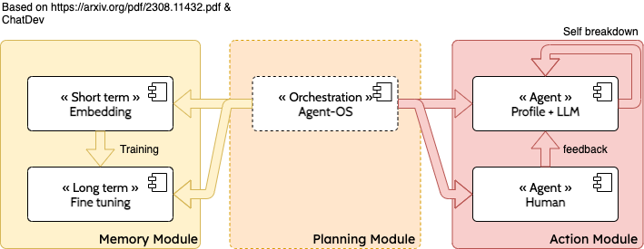

# agents-os

Operating System controlling agent for a specific tasks.

# See also

* This is following research from [jupyter-workbench/\_docs\_/llm](https://github.com/frtu/jupyter-workbench/tree/master/_docs_/llm)