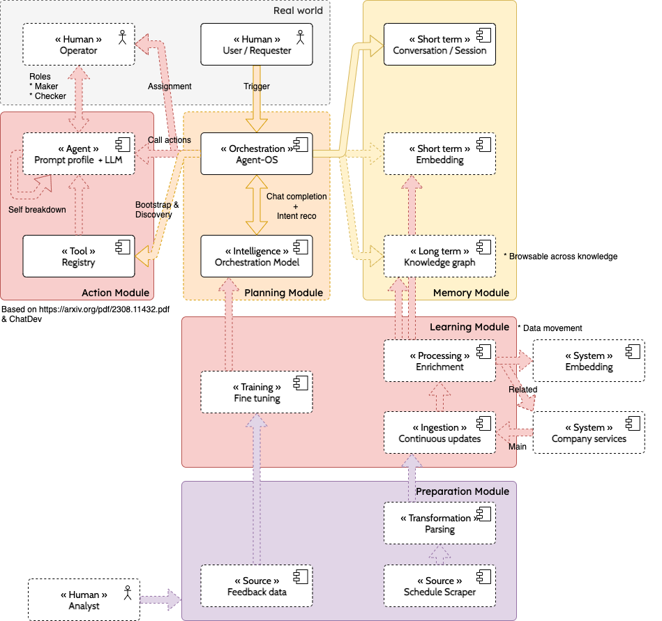

# Project - agents-os

## About

Operating system allowing to **connect the real world users with agents**. It allows to incrementally automate process by creating static `Workflow definitions` (predictible) & `Prompts` (more dynamic) :

1. transfering Team SOP into `Durable Workflow` that create `Assignments` to `Operators` (Makers & Checkers)
2. adding `Function tool` to accelerate & faciliate human actions
3. adding `Maker workflow` to statically orchestrate task by composing tools
4. partially or completely replace Maker with `Agent` dynamically orchestrating those tools but still keeping `Assignment` to human Checker
5. eventually repeat step 2 to 4 to automate `Checker`

At runtime, `Requester` input triggers calls to `AgentOS` which

* calls `LLM` to plan / orchestrate when to call `Operator`, `Agent` and `Memory` :



## Modules

### Real world

The system is meant to integrate with an existing organisation and process, by incrementally transfering human process into repeatable workflows that first involves operators.

### Action Module

Action module happen when an operation needs to be achieved (Maths, Retrieval, etc)

#### Human assignment

Interface to allow user to take action & respond. Human interaction should be time framed to avoid process to be blocked indefinitively. It should be well defined by

* all the input information that are required to take actions
* specific output details (succeed, failure OR request for further infos)

#### Agents

Actions can be grouped into an Agent, which is a specialized entity / customized LLM with a specific Profile / Persona
(ex: `you are a 10 years specialized travel agent`).

This agent has can operate multiple actions / tasks
(ex: `your tasks is to propose a {{ num_of_days}} schedule to {{ destination }}`).

##### Evolution

* [Currently] Static (configure locally with code)
* [Future] Ability to add function dynamically with API

#### Registry

All the actions are stored as Tool definitions and parameters. A tool can be an [assignment to a human](#human-assignment), a system function or an [action call to agent](#agents).

Can be used :

* when passing available tools to LLM
* for matching completion response and calling [Action module](#action-module)

### Planning Module

#### Intelligence dynamic orchestration model

Calling LLM to decide what function to call using Chat completion.

#### Potential evolution

* Starting with generic model that we can choose
* Allow fine tuning & specialisation based on new training data

#### Intent recognition

Adding [IntentClassifierAgent.kt](service%2Fsrc%2Fmain%2Fkotlin%2Fcom%2Fgithub%2Ffrtu%2Fai%2Fos%2Fservice%2Fagent%2FIntentClassifierAgent.kt),
that test ability to provide Intent recognition / classification :


### Memory Module

#### Conversation

* system : System directive
* user : Interaction with User
* assistant : Agent / Assistant
* function : Function calls

```
with(Conversation()) {
    system("You are a helpful assistant.")

    chat.sendMessage(user("Who won the world series in 2020?"))
```

#### Embedding (Short term memory) - TBD

Storage for raw knowledge allowing retrieval by similarity (embeddings)

#### Knowledge base (Long term memory) - TBD

Storage for assimilated knowledge into a graph

### Learning Module

#### Processing - Ingestion & Enrichment

Allow data to continuously integrate into [Embeddings](#embedding-short-term-memory---tbd) & [Knowledge base](#knowledge-base-long-term-memory---tbd). Raw data is :

* received
* enriched
* transformed into the final form of the knowledge base

#### Potential evolution - Fine-tuning

Allow specialisation of LLM for assimilated knowledge by fine tuning information into the model itself based on learned data

## Appendix

### Release notes

#### 0.1.0-SNAPSHOT - Current version

* Static Function Registry

### See also

* [OpenAPI Chat completion API](https://platform.openai.com/docs/guides/text-generation/chat-completions-api)
* Originated from [jupyter-workbench/\_docs\_/llm](https://github.com/frtu/jupyter-workbench/tree/master/_docs_/llm)

