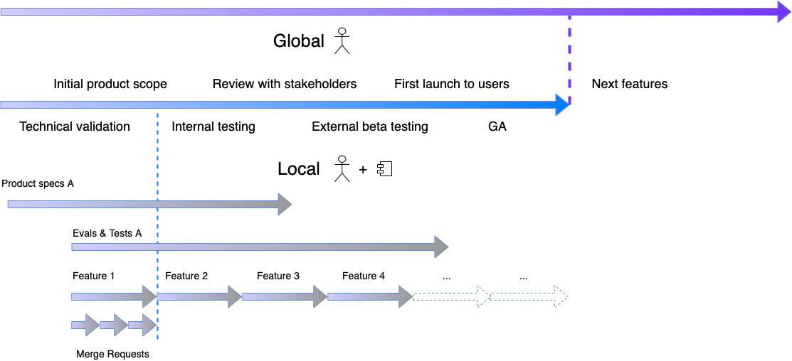
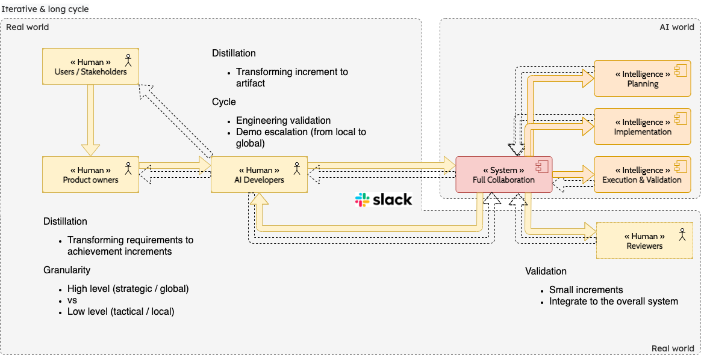

# Augmented development

Development is changing. The traditional development cycle had two main parts: (1) converting product requirements to code and (2) reverting back to the product team on feasibility, evaluation, and advising on the best solution—the rise of AI has fundamentally **evolved this dynamic**.

The first part, converting requirements to code, is now rapidly accelerated & **augmented** by Generative AI. This part of the process is no longer a bottleneck & should be assisted by AI Code generation with **great efficiency & disruptive process** described below.

Consequently, the second part, where humans provide value, becomes the crucial focus by delegating execution to AI Code generation, freeing human developers to **focus on higher-value tasks** like

- strategic planning
- reverting back to the product team on feasibility.
- iteratively refining requirements, evaluations, advising on the best solution.
- continuous demonstration to stakeholders & collecting feedback in a methodical and unambiguous way

The shift to **augmented development** is a disruptive change from a linear, traditional process to an iterative and collaborative one. The central human role becomes continuous feedback between product creation and stakeholders through methodical demonstrations, transforming development into a process centered on **strategic oversight and iterative refinement**, not one-shot code generation.

## Simple Cycle : Fast, Short Project

The simple process consists of these steps:

- **Know the target goal:** You MUST know exactly what you are trying to achieve.
- **Generate the solution:** The process involves multiple attempts to generate the artifact or solution in a single shot.

This is achieved with

- **Prompt engineering:** This is the key to achieving the cycle, where you carefully modify prompts to correctly generate the artifact the first time.
- **Validation:** A validation cycle is used to confirm the goal is achieved by executing the artifact without errors and reaching the target goal.

The AI handles the "how," allowing engineers to focus on the "what." like generating SQL query, run it & validate the output satisfy the desired target.


## Macro Cycle - Iterative, Long-Term Impact

### Iterative project increments

While the core loop is fast, real-world projects are complex and require multiple iterations. The macro cycle is where humans provide the critical oversight and strategic direction. This is a collaborative, long-term process that consists of:

- **Continuous Refinement**: For innovative projects, the product is not static; it is *discovered and refined* as it is built. This means we are constantly evolving the requirements.
- **Incremental Builds**: Instead of a single, large release, we will generate and test successful product *increments in a reliable, repeatable* cycle. These small increments are easier to validate and integrate into the overall system.
- **Stakeholder Validation**: Our engineers are now freed up to engage in crucial tasks like validating feasibility, advising on the best solutions, and demonstrating progress to stakeholders and end-users. This is the most crucial part of the human role in this new process.

The following diagram illustrates this iterative and long-term cycle, showing how local, tactical development (the core loop) contributes to the global, strategic project increments.



### Local generation cycle

This is the new collaboration model: humans, acting as AI developers, work with the AI to transform high-level requirements into small, validated increments. 

The **Distillation** process is key, as it involves both 

- **Product owners** : transforming high-level requirements into achievable increments
- **AI developers** : transforming those increments into the final artifact using different AI module at all the creation cycle of developments



#### Code generation increments

```
Tight balance between speed & safety
```

To continuously allow **Human reviewers** validation, increments must be small, ensuring secured integration into the overall system without loosing control or quality over tech debts.

Companies should set their **quality bar & development validation** carefully

## Hands-on

To follow up with [AI Code gen technical enablement](augmented_dev_tech_enablement.md)