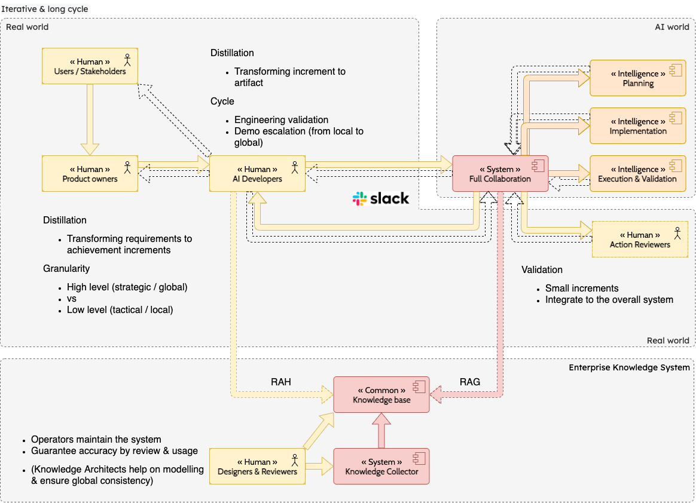

# Augmented development

`Development assisted with AI` is disruptively changing the way we create code. 

Development consist on

1. converting Product requirement to code 
2. BUT also reverting back to Product on feasability, running evaluating & advising on the best solution

Item #1 is quickly boosted with Generative AI, while item #2 become crucial for human to focus on. For efficiency concerns, the goal is not just to Generate artifact / code in one shot, but rather centralise on planning a methodic & non ambiguous requirements refinement while experimenting & showing back to stakeholders.

## Fast & short cycle

Simple cycle consist of 

* knowing exactly the target goal (what we try to achieve)
* & multiple attempts to generate the solution / artifact in `one-shot` (code & successful feedback)

This achieved by Prompt engineering, by carefully attempting to 

* generate artifcat 
* and modifying the prompt to generate artifact correctly the first time (generating SQL query & run it)
* validation cycle to confirm the goal is achieved by executing without error & reaching the target goal

## Iterative & long cycle

### Project increments

### Development cycle

Collaborative & real life project rather consist of multiple iterations where

* Product is discovered & refine as it is built (innovative project)
* Generate successfully the product increment (while multiple projects help to build a product, the cycle is reliably & preditably repeated over increments)
* Test against stakeholders & eventually end users

