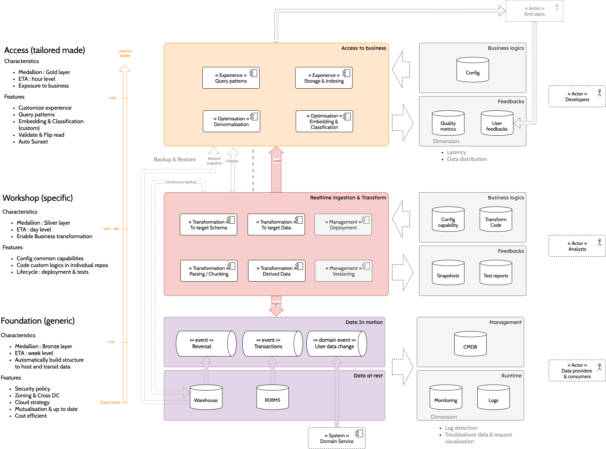

# Knowledge system for Enterprise

## Overview for Q&A

To conduct day to day operations, Customers or Employees require a single & reliable view on the system. Since the dawn of time, medium to access [enteprise counter services](#Counter_service_medium) has evolved to reliabily answers customer questions.

### Reliable knowledge base

LLM answer adhoc questions using his generic knowledge learnt during training. To answer enterprise questions (by end user or employee), LLM need to answer questions on latest data in a consistent & reliable manner.

In enterprise, each system is optimised for consistence (database transaction). With the rise of microservice, each data is chunk and managed by a dedicated system, creating an explosion of information as enterprise grow.

The need for a consolidated, quality validated & troubleshooting system for error is the key to all reliable Q&A system delivered to customer

## Building a knowledge base

Building the knowledge base should be **predictable and tested** to ensure high level quality of the information (normally higher than letting LLM guess).

Building blocks :

* Nodes / Entities
* Relationship / Edge
* Properties

The process usually involves :

* Entity extraction : retrieve all the entity / nodes
* Relationship & properties connection : connecting entity with KV attributes allowing more subteties when retrieving

#### Non functional requirements

* Time accuracy : Based on volatility : realtime vs batch.
* Security & Compliance : give the right access to the right person. Auditable system

## Knowledge infrastructure

"Transforming data into information then to knowledge & wisdom"

### Architecture

On the left side, data cross **different maturity stages** following the [medallion architecture](https://www.databricks.com/glossary/medallion-architecture) principle for realtime.

At each stage, **latencies** are tracked and allow to detect data freshness shift. New deployment may introduce new delays & should be tracked between version. 

During the blue green deployment (introducing new changes), the **validation / certification step** should include

* **Data freshness** across version : previous compute and new compute delay can be compared, optimised & approved.
* **Data distribution** across version : if fields already exists in the previous version, high level statistics (total, etc) & value distribution could be compared.

The application is released to end user and **effectiveness** is dynamically tracked and report back to business.

#### Stage

|                 |           | Foundation (generic)                                                                                             | Workshop (specific)                                                                                          | Access (tailored made)                                                              |
|-----------------|-----------|------------------------------------------------------------------------------------------------------------------|--------------------------------------------------------------------------------------------------------------|-------------------------------------------------------------------------------------|
| Characteristics | Medallion | Bronze                                                                                                           | Silver                                                                                                       | Gold                                                                                |
|                 | ETA       | Week level                                                                                                       | Day level                                                                                                    | Hour level                                                                          |
|                 | Goal      | Automatically build structure to host and transit data                                                           | Enable Business transformation                                                                               | Exposure to business                                                                |
| Features        |           | * Security policy * Zoning & Cross DC * Cloud strategy * Mutualisation & up to date * Cost efficient | * Config common capabilities * Code custom logics in individual repos * Lifecycle : deployment & tests | * Customize experience * Query patterns * Embedding & Classification (custom) |

### Backup & Restoration

Continous Backup :

* transformed Silver data should be consolidated & compacted in a long term storage store, 
* allowing to **take snapshot** of data by **time & offset** (all previous data captured from that time)

Restoration :

* backuped Silver data can be send from Archive to Live environment for reprocessing. 
* for the most recent data, **offset** could be used to replay from Kafka

### Enablers - Tools & Ecosystem

In order to manage all the data empowering the knowledge system, Metadata & Tags need to be gather and maintain (keep fresh).

Cataloging is the system that aims to satisfy human & agent questions

* data availability
* lineage
* request management (from needs to reality)
* during troubleshooting

#### Metadata catalog

##### Intrinsic attributes of data

* volatility : low volatility (structural) vs high volatility (operational)
* structure vs unstructured

##### Security

* private public
* Tagged / enriched by company

## Retrieval

Steps

* entity identification
* relationship navigation

Relevance instead of Resemblance 

### Processing - Aggregation

Pulling filter agg sort

### Security

Data access must be subjective : 

* who can see what?

The perfect test for security is two users with different profiles should see 2 different "projection" of the same data.

## Lifecycle

#### Cataloging

* Move from human to machine tagging / labelling

#### Test comprehension

* Use Evals to test & improve labels VS questions
* Leverage human user to find what they need

#### Feedbacks / Insights

Resolved?

* Metadata issues : is our understanding of the need correct?
* Data issues : is that the correct set of data (time or data problem)?
* Compute issues : is the calculation incorrect?

## Details

### Counter service medium

For banks, the old world started with physical counter where customer could ask their questions and raise request & operators would answer and take actions. With availability & convenience, incremental digitalisation started to replace counter with

* **Physical ATM** : service offer by counter are available 24/7, but user still have to go to a specific location with a card. ATM started to bloom to get closer to customer
* **Web at home** : personal computer enable user to access service from home. Way to authentify become more and more modern
* **Mobile** : even on the move, user are able to access to those service. With Touch ID or Face recognition, authentication has never been that convenient.
* In the future **AR headset or new tools** would modernise accessibility

## See also

* https://stackoverflow.co/teams/resources/knowledge-base-101/
* [From Local to Global: A GraphRAG Approach to
Query-Focused Summarization](https://arxiv.org/pdf/2404.16130O)
* [GraphRAG](https://github.com/Graph-RAG/GraphRAG)