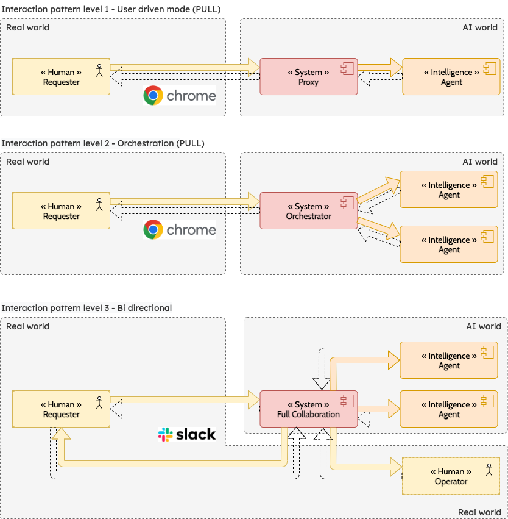
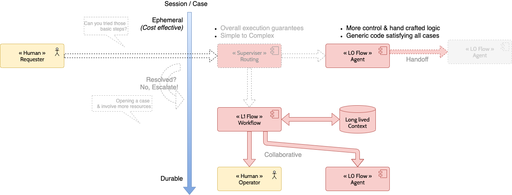
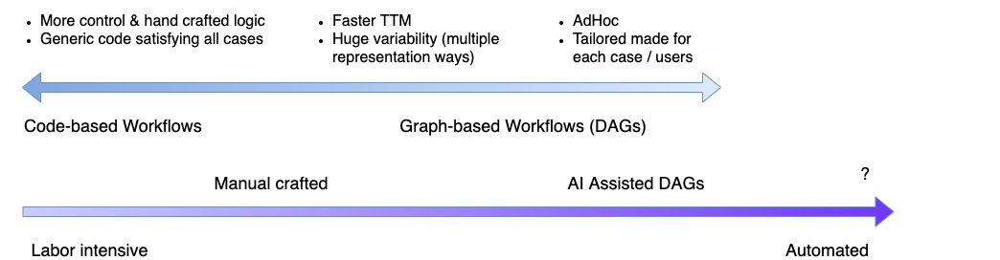

# Why We Need Durable Workflows

## From Simple LLMs to Human-in-the-Loop Systems

### Interaction level

As AI systems become more interactive and intelligent, the nature of execution shifts across multiple levels of complexity:

* Level 1 – Basic LLM Execution:
A single LLM call is made, taking a few seconds to generate a response. The interaction is synchronous and short-lived.

* Level 2 – Multi-Step LLM Orchestration:
The system chains multiple LLM calls together. Execution time increases, and you must account for partial failures, retries, and transient errors—all of which demand orchestration over a longer timespan.

* Level 3 – Machine + Human Collaboration:
Workflows now involve both AI systems and human input. For instance, the system might pause to wait for a human decision before continuing. These interactions introduce unpredictable delays, making it essential to pause and resume workflows reliably and without loss of context.

### Case escalation

At first, execution is routed to an lightweight & cost effective self resolution. This is the full automated mode that should take over 80% of execution over time.

Escalation : 

* After certain delay OR if Agent exhaust all its resources and give up
* Execution is routed to a more long lived and resource intensive approach (ex: human intervention, call to external vendor services, ...)

## Solution

To support these increasingly asynchronous and long-running interactions, we rely on [Temporal](https://temporal.io/) — a platform purpose-built for durable workflows. 

Temporal ensures that:

* Workflows can pause and resume safely, even across days or weeks.
* Execution state is persisted and replayable, enabling precise error recovery.
* Human-in-the-loop and machine-driven steps are orchestrated predictably and reliably.

Technical details below.

## Technical details

### What is durable Execution using Temporal

[Temporal](https://temporal.io/) provides a durable **orchestration engine** designed to reliably manage business-critical workflows — especially those involving **longer computation or interaction with humans** that can span over hours, days, or even months. Unlike traditional execution platforms that operate within an ephemeral context, Temporal persists workflow execution history, allowing it to resume seamlessly after restarts, failures, or long waits.

Each [Workflow Execution](https://docs.temporal.io/workflow-execution) represents a specific business process, triggered by well-defined input parameters (e.g., “Create IT support ticket for abc@test.com”). Temporal ensures every steps are **executed successfully once & captured** for long term replay until executions goes to the end.

### Workflow defintion (heavy vs lightweight)

Workflows in Temporal can be defined in two ways:

* `Code-based Workflows`: Developers write workflows as code, which follows the standard software development lifecycle (compilation, test, deploy, rollback). At any point in time, a **single definition version** is live & must be able to resume any previous execution.

* `Graph-based Workflows (DAGs)`: Alternatively, workflows can be modeled a form of a Graph (DAG). This allows faster iteration, generation on the fly and versioned deployment, where **multiple versions** can coexist — each tied to specific executions. To a certain extreme, a workflow definition can be specifically created for each adhoc use cases & live until execution terminates.

From labor aspect, Coding is need highly trained developpers, DAG can be created by anyone with business knowledge. Eventually DAG could be created correctly by AI.

#### Static definition vs Dynamic definition

Workflow DAG can be

* `static` : fixed definition ensuring predictability. Everytime SOP evolves, it should be capture into the DAG definition by a human.
* `dynamic` : variable definition of DAG that is created at runtime. Definition can vary based on parameter to adapt more accurately to the parameters.
* `mixed` : best practices can be capture into a high level static flow that provide a fixed structure to evolve. Low level / last mile execution can be discovered at runtime. If dynamic execution fails, it can fallback to the a default fixed definition.