# Leader Control Center

> As leaders, we don't have time to only solve one task at a time.

A human-in-the-loop control center for supervising durable AI workflows.

---

# Vision

Modern AI agents are capable of executing work that spans minutes, hours, or even days. Unlike conversational assistants, these workflows frequently pause to request clarification, approvals, permissions, or additional information before they can continue.

As leaders, we don't have time to constantly context-switch between dozens of conversations just to answer simple questions like:

- "Can I continue?"
- "Which option should I choose?"
- "Can I access this system?"
- "Please review this document."

Today's AI interfaces are conversation-centric.

Leader Control Center is execution-centric.

Instead of managing one AI conversation at a time, leaders supervise multiple concurrent initiatives through a single operational control center.

The application allows leaders to:

- Plan work
- Launch AI executions
- Monitor progress
- Respond to human requests
- Review generated artifacts
- Continue execution
- Audit execution history

without losing context.

The application is **not** a workflow engine.

It is a **Meta Orchestration Control Plane** built on top of durable workflow engines.

---

# Goals

Leader Control Center aims to become the operational console for durable AI execution.

The application should allow leaders to:

- supervise multiple concurrent AI initiatives
- organise work around business outcomes
- reduce interruption fatigue
- maintain human strategic control
- support long-running execution
- provide complete execution history
- progressively automate execution over time
- remain independent of any specific workflow engine or AI provider

---

# Non Goals

Leader Control Center is NOT:

- a workflow engine
- a chat application
- a project management replacement
- an LLM framework
- an MCP server
- an AI coding IDE

Instead, it coordinates these systems.

---

# Product Principles

## Human First

Humans remain responsible for:

- planning
- priorities
- approvals
- clarifications
- strategic decisions

AI remains responsible for execution.

---

## Business First

The platform models business outcomes.

Workflow engines, LLMs, MCP servers and providers are implementation details hidden behind the execution layer.

---

## Human View ≠ System View

Leaders naturally think in terms of business initiatives.

Examples:

- Platform Modernization
- Create Agent Orchestration Flow
- Agent Worklfow V2
- AI Adoption
- Database Migration

Internally, however, planning is still represented using familiar concepts:

- Epic
- Story
- Task

This separation allows the system to present a business-centric experience while preserving a clean and extensible planning model.

---

## Planning ≠ Runtime

Planning defines what should happen.

Runtime records what is happening.

Planning should remain stable throughout execution.

Executions may:

- retry
- fail
- pause
- resume
- restart

without modifying planning.

---

## Progressive Automation

Every autonomous capability must first exist as an explicit capability.

Users should always be able to choose between:

- explicit planning
- AI-assisted planning
- fully autonomous planning

without changing the architecture.

The evolution path should look like:

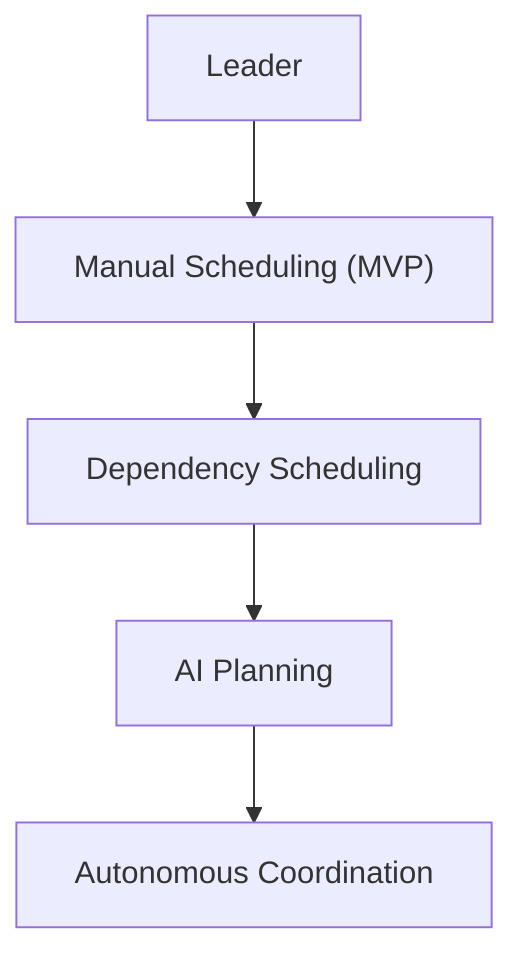

---

# Domain Overview

Leader Control Center separates the platform into two complementary perspectives.

## Human View

The user supervises **Initiatives**.

An Initiative represents a business outcome.

Examples:

- Platform Modernization
- Create Agent Orchestration Flow
- Agent Worklfow V2
- AI Adoption
- Database Migration

Everything the leader needs is grouped under an Initiative:

- planning
- progress
- executions
- waiting approvals
- artifacts
- history

The leader never needs to understand workflow engine concepts.

---

## System View

Internally, an Initiative is composed of:

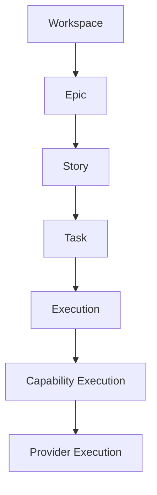

The planning hierarchy remains stable while runtime evolves independently.

---

# Domain Model

From a leader's perspective, every business outcome is represented as an **Initiative**.

```
Portfolio
└── Initiative (Human View)
      ├── Planning
      │     │
      │     ├── Epic
      │     │      │
      │     │      ├── Story
      │     │      │      │
      │     │      │      ├── Task
      │     │      │      ├── Dependency
      │     │      │      └── Acceptance Criteria
      │     └── Planning Metadata
      │
      └── Runtime
            ├── Story Execution
            │      ├── Task Execution
            │      │      ├── Capability Execution
            │      │      │      │
            │      │      │      ├── Provider Execution
            │      │      │      ├── Provider Execution
            │      │      │      └── Provider Execution
            │      │      ├── Timeline
            │      │      ├── Human Requests
            │      │      ├── Decisions
            │      │      └── Artifacts
            │      └── Metrics
            └── Attention Queue
```

Planning remains immutable.

Runtime is disposable.

History is permanent.

---

# Core Concepts

## Portfolio

The top-level organizational boundary backed by a `Workspace`.

A Portfolio owns:

- Initiatives
- Users
- Providers
- Credentials
- Capability Catalog
- Integrations
- Default AI configuration

Future versions may support multiple Portfolio.

---

## Initiative

The primary business object presented to leaders.

An Initiative represents a business outcome.

Examples:

- Platform Modernization
- Create Agent Orchestration Flow
- Agent Worklfow V2
- AI Adoption
- Database Migration

An Initiative groups:

- planning
- runtime
- decisions
- artifacts
- history

Internally an Initiative is backed by one or more Epics together with their runtime executions.

---

## Epic

Represents the primary planning container.

An Epic groups Stories contributing toward one Initiative.

Epics remain implementation details.

Leaders interact with Initiatives rather than Epics.

Epics should remain achievable within approximately one month.

---

## Story

Represents a business deliverable.

Examples:

- Write promotion document
- Create architecture proposal
- Build migration strategy

Stories progress through the planning board and own one or more Tasks.

---

## Task

A Task represents a unit of planned work.

A Task defines **what** should be accomplished.

A Task never defines **how** execution occurs.

Execution decisions are deferred until runtime.

Tasks may be planned in two different modes:

- Structured
- Goal-Oriented

## Planning Modes

Leader Control Center intentionally separates **planning** from **execution**.

Planning defines business intent.

Execution determines how that intent is fulfilled.

Every Task is created using exactly one **Planning Mode**.

```
Planning Mode
├── Structured
└── Goal-Oriented
```

Both planning modes ultimately normalize into the same execution model.

This allows users to progressively adopt AI planning without changing the runtime architecture.

---

### Structured Planning

Structured Planning is the default.

The leader explicitly defines:

- Task name
- Capability
- Dependencies
- Acceptance Criteria

Example

```
# Task
Write Design Document
# Capability
Write Markdown
# Acceptance Criteria
- Executive quality
- Less than three pages
- Ready for manager review
```

This mode provides predictable and deterministic execution.

It is recommended for production workflows.

---

### Goal-Oriented Planning

Goal-Oriented Planning delegates task decomposition to the AI Planner.

Instead of selecting a Capability, the leader describes the desired outcome.

Example

```
# Goal
Prepare a promotion package that demonstrates my
technical leadership and business impact.
# Success Criteria
- Executive quality
- Metrics included
- Ready for review
```

The AI Planner determines:

- Capabilities
- Dependencies
- Execution order
- Suggested providers

before execution begins.

---

### Progressive Planning

The application intentionally supports increasing levels of autonomy.

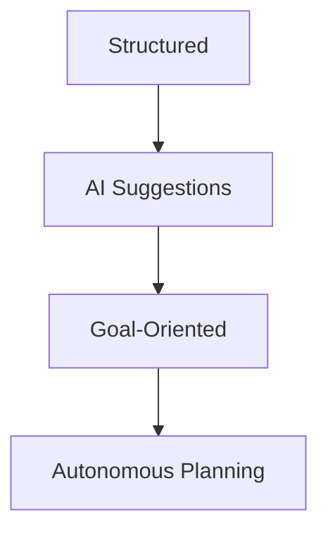

Users can gradually adopt AI planning without changing their workflows.

---

# Runtime Objects

Planning creates runtime objects.

Planning itself is never modified.

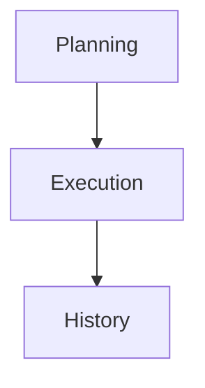

Every execution is immutable history.

---

## Story Execution

Represents one runtime instance of a Story.

Responsibilities:

- orchestrate Tasks
- monitor progress
- aggregate status
- produce artifacts
- expose timeline

---

## Task Execution

Represents one execution instance of a Task.

Responsibilities:

- invoke capabilities
- monitor execution
- request human interaction
- publish runtime events

A Task may execute multiple times without modifying planning.

---

## Capability Execution

Capability Execution represents **what ability is required**.

Examples:

- Research
- Write
- Review
- Search
- Diagram
- Code
- Translate
- Test
- Analyze
- Summarize

Capabilities are stable business concepts.

They are intentionally independent from AI providers.

---

## Provider Execution

Provider Execution represents the concrete implementation.

Examples

```
OpenAI
Anthropic
Gemini
Cursor
GitHub MCP
Slack MCP
Temporal Activity
Human
```

Providers may change over time.

Capabilities remain stable.

---

# Capability Model

Capabilities describe **what the platform can do**.

They do not describe:

- prompts
- LLMs
- providers
- execution engines

```
Capability
id
name
description
inputs
outputs
supported providers
```

Example

```
Capability
Write Markdown
Inputs
Markdown Specification
Outputs
Markdown Document
```

---

## Capability Catalog

Capabilities are reusable across every Initiative.

```
Capability Catalog
Research
Search
Review
Write Markdown
Generate Diagram
Generate Presentation
Generate Code
Analyze
Summarize
Translate
Test
Deploy
Review Architecture
```

The Capability Catalog is managed at Workspace level.

---

# Provider Model

Providers execute Capabilities.

Providers are completely interchangeable.

Examples

```
OpenAI
Anthropic
Google Gemini
GitHub Copilot
Cursor
Claude Code
Human
Slack MCP
GitHub MCP
Temporal Activity
```

Providers expose a common contract.

```
supports()
estimate()
execute()
cancel()
resume()
```

Providers should never contain business logic.

---

# Execution Strategy

Execution Strategy determines **how** a Capability is executed.

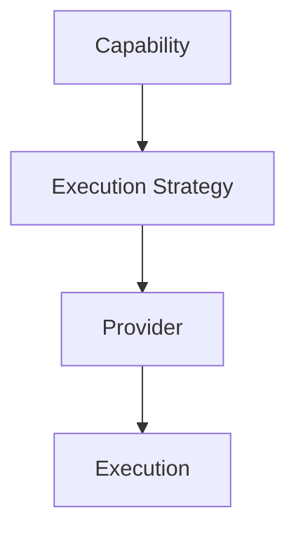

Separating strategy from provider enables progressively more advanced orchestration.

---

## Supported Strategies

### Single Provider

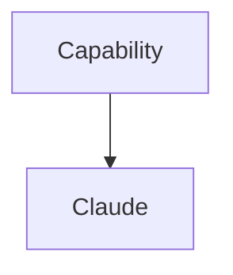

---

### Retry

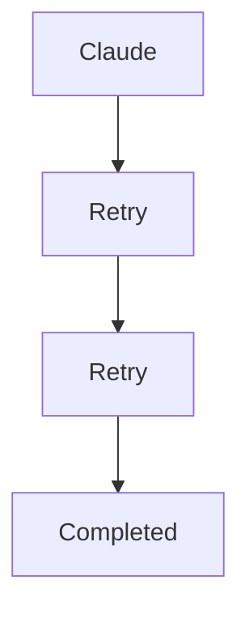

---

### Parallel

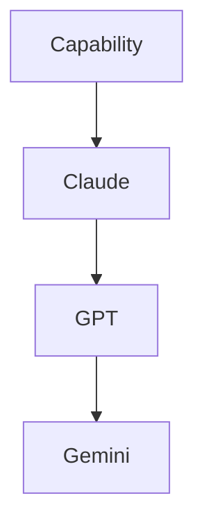

---

### Consensus

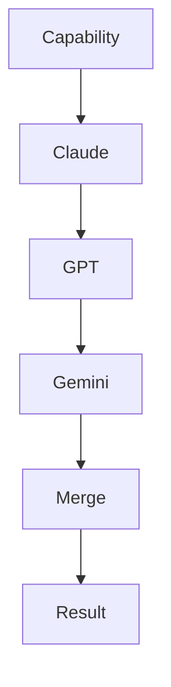

---

### Human Review

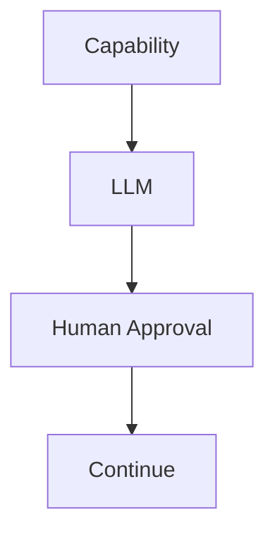

---

### Pipeline

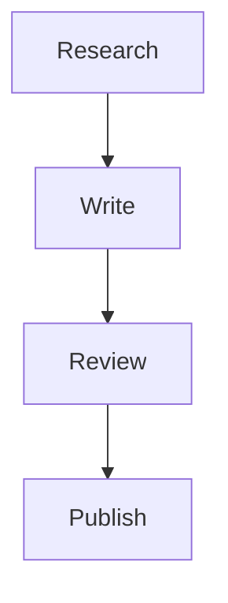

---

### Loop

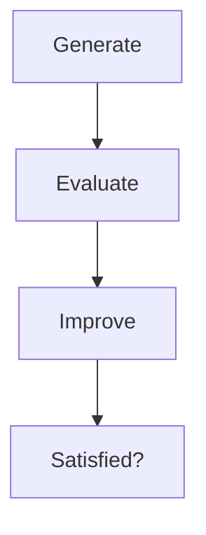

---

### Fan-Out

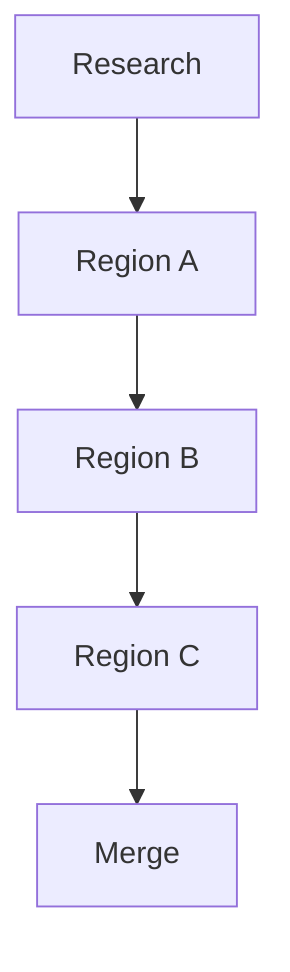

Execution Strategies are implementation details and may evolve independently from planning.

---

# Human Requests

The platform pauses execution only through Human Requests.

Examples

- Approval
- Clarification
- Budget
- Tool Permission
- Missing Information
- Choose Option
- Risk Acceptance

Human Requests are first-class runtime objects.

---

# Decisions

Every Human Request produces exactly one Decision.

Supported decisions:

- Approve
- Reject
- Clarify
- Continue
- Abort
- Retry
- Select Option

Decision history is immutable.

---

# Artifact Model

Artifacts are first-class business objects.

Examples

- Markdown
- Specification
- Diagram
- Image
- PDF
- Spreadsheet
- Presentation
- Source Code
- Test Report

Artifacts are immutable.

Updating an Artifact always creates a new version.

```
Artifact
id
type
version
owner
created by
created at
metadata
```

---

# Timeline

Everything that happens becomes an immutable event.

Examples

```
Execution Started
Capability Started
Capability Completed
Provider Failed
Retry Scheduled
Approval Requested
Decision Received
Artifact Produced
Execution Completed
```

The Timeline is append-only.

History is never modified.

---

# Workflow Hierarchy

```
Story Execution
├── Task Execution
│      ├── Capability Execution
│      │       │
│      │       ├── Provider Execution
│      │       ├── Provider Execution
│      │       └── Provider Execution
│      ├── Human Request
│      ├── Artifacts
│      └── Timeline
└── Task Execution
```

Every layer has exactly one responsibility.

Planning never depends on Runtime.

Runtime never modifies Planning.

---

# State Machines

## Planning

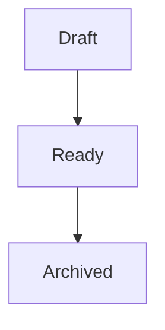

---

## Task

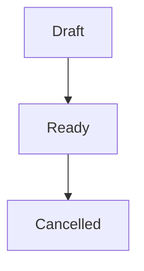

---

## Story Execution

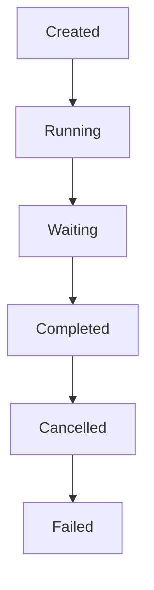

---

## Capability Execution

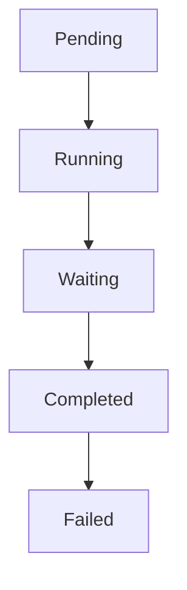

---

## Provider Execution

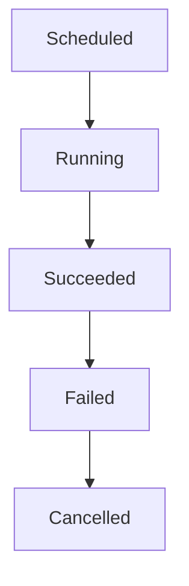

Provider failures do not necessarily imply Capability failures.

Execution Strategy determines whether retries, failover, consensus, or human intervention should occur.


---

## Story Execution

Runtime instance of a Story.

Responsible for orchestrating Task executions.

---

## Task Execution

Runtime instance of a Task.

Responsible for coordinating one or more Agent executions.

---

## Agent Execution

Lowest execution level.

Responsible for:

* LLM interaction
* MCP integration
* Tool usage
* Search and retrieval
* Code generation
* Document generation

---

# Runtime Objects

## Human Request

Represents something requiring human attention.

Examples:

* Approval required
* Clarification required
* Tool permission
* Missing information
* Budget exceeded

---

## Decision

Represents a human response.

Examples:

* Approve
* Reject
* Clarify
* Continue
* Abort
* Select option

Workflows wait for Decisions instead of approvals.

---

## Artifact

Output produced by an execution.

Examples:

* Markdown
* Specification
* Presentation
* Diagram
* Spreadsheet
* Source code
* Image

Artifacts are first-class domain objects.

---

## Timeline

Every execution produces an immutable event timeline.

Examples:

* Started
* Waiting Approval
* Clarification Requested
* Continued
* Failed
* Completed

---

# Planning Workflow

Planning is the internal representation of an Initiative.

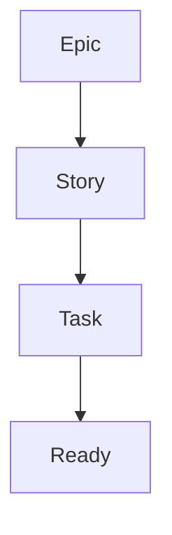

Planning remains stable throughout execution.

---

# Execution Workflow

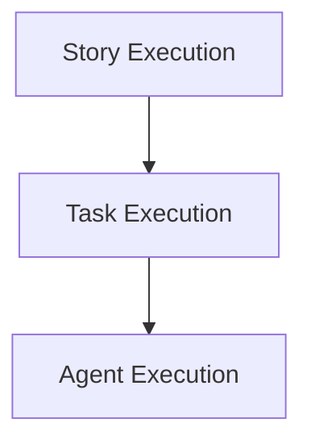

Each level owns a different responsibility.

---

# Task States

Planning states.

```mermaid
flowchart TD
    N0[Draft]
    N1[Ready]
    N2[Running]
    N3[Waiting]
    N4[Blocked]
    N5[Completed]
    N6[Cancelled]
    N0 --> N1
    N1 --> N2
    N2 --> N3
    N3 --> N4
    N4 --> N5
    N5 --> N6
```

Only **Ready** tasks may be started.

---

# Scheduling Strategy

The application intentionally separates scheduling policy from execution.

```
Story Workflow
↓
Scheduling Strategy
├── Manual Scheduling
├── Dependency Scheduling
└── AI Planning
```

## MVP

Manual Scheduling.

The leader explicitly starts every task.

```mermaid
flowchart TD
    N0[Leader]
    N1[Start Task]
    N2[Backend]
    N3[Workflow Engine]
    N0 --> N1
    N1 --> N2
    N2 --> N3
```

## Future

Dependency Scheduling.

Tasks automatically start when dependencies are satisfied.

## Future

AI Planning.

AI dynamically creates, reprioritizes and launches Tasks.

---

# Workflow Hierarchy

```
Story Execution
├── Task Execution
│     ├── Agent Execution
│     ├── Agent Execution
│     └── Agent Execution
└── Task Execution
```

This hierarchy enables:

* Parallel execution
* Retry
* Pause
* Resume
* Human approval
* Dynamic fan-out

---

# User Interface

The primary interface is an **Initiative Board**.

Unlike traditional Kanban applications that organize work around planning artifacts, Leader Control Center organizes work around **business initiatives**.

```
Workspace
├── Platform Modernization
├── Create Agent Orchestration Flow
├── Agent Worklfow V2
├── AI Adoption
└── Database Migration
```

Each Initiative acts as a collapsible workspace exposing both planning and runtime.

---

## Initiative View

Selecting an Initiative presents a unified operational view.

```
┌──────────────────────────────────────────────┐
│ Platform Modernization                       │
├──────────────────────────────────────────────┤
│ Goal                                         │
│ Progress                                     │
│ Attention Queue                              │
│                                              │
│ Stories                                      │
│ Runtime                                      │
│ Artifacts                                    │
│ Timeline                                     │
│ AI Activity                                  │
└──────────────────────────────────────────────┘
```

The objective is to answer the leader's primary question:

> **"What requires my attention right now?"**

---

## Planning Board

Planning remains Kanban-based.

```
Todo
Ready
Running
Blocked
Completed
```

Stories move across the board.

Tasks remain visible inside Stories.

Planning never displays provider-specific information.

---

## Runtime Inspector

Selecting a Story opens the Runtime Inspector.

```mermaid
flowchart TD
    N0[Story]
    N1[Executions]
    N2[Capabilities]
    N3[Providers]
    N4[Logs]
    N0 --> N1
    N1 --> N2
    N2 --> N3
    N3 --> N4
```

The Runtime Inspector focuses on operational visibility rather than planning.

---

## Execution Timeline

Every execution exposes a complete event history.

Example:

```
09:00 Story Started
09:01 Research Started
09:05 Claude Completed
09:06 Review Started
09:08 Waiting Approval
09:15 Approved
09:16 Continue
09:18 Completed
```

The Timeline is immutable and fully auditable.

---

## Artifact Explorer

Artifacts are grouped by Story and Initiative.

```
Promotion
├── README.md
├── Architecture Diagram
├── Presentation
├── Resume
└── Final Proposal
```

Every Artifact exposes:

- Version history
- Producer
- Creation timestamp
- Associated execution
- Associated capability

---

## Attention Queue

The Attention Queue aggregates every execution requiring human intervention.

Examples:

```
Waiting Approval
Waiting Clarification
Execution Failed
Budget Approval
Permission Required
Review Requested
```

This queue is global across all Initiatives.

The leader should never need to manually inspect every execution.

---

## AI Activity

The platform continuously displays AI activity.

Examples:

```
Researching...
Generating Architecture...
Reviewing Code...
Waiting Human...
Retrying Provider...
Completed
```

The UI intentionally exposes capabilities instead of provider names.

Instead of

```
Claude Running
```

the leader sees

```
Generating Architecture
```

Provider details remain available inside execution details.

---

# Architecture

```mermaid
flowchart TD
    FE[React Frontend]
    API[REST + WebSocket API]
    BE[Backend API]
    DOM[Domain Application Layer]
    EXEC[Execution Coordination Layer]
    CAP[Capability Engine]
    STRAT[Execution Strategies]
    REG[Provider Registry]
    subgraph Providers
        OAI[OpenAI]
        ANT[Anthropic]
        FUT[Future Providers]
    end
    WF[Workflow Adapter]
    subgraph Engines
        TEMP[Temporal]
        FUTE[Future Engines]
    end
    FE --> API
    API --> BE
    BE --> DOM
    DOM --> EXEC
    EXEC --> CAP
    CAP --> STRAT
    STRAT --> REG
    REG --> OAI & ANT & FUT
    OAI & ANT & FUT --> WF
    WF --> TEMP & FUTE
```

---

# Technology Stack

## Frontend

- React
- TypeScript
- TailwindCSS
- shadcn/ui
- TanStack Query
- Zustand

---

## Backend

- Python
- FastAPI
- Pydantic
- OpenAPI
- PostgreSQL

---

## Runtime

- Temporal

Future adapters:

- Azure Durable Functions
- AWS Step Functions
- Google Workflows

---

## AI Providers

Initially supported:

- OpenAI
- Anthropic

Future:

- Gemini
- Cursor
- Claude Code
- Local Models

---

## Storage

Planning and Runtime are intentionally separated.

Planning Database

- Workspace
- Initiative
- Epic
- Story
- Task
- Dependencies

Runtime Database

- Executions
- Timeline
- Artifacts
- Human Requests
- Decisions
- Metrics

This separation prevents execution concerns from polluting planning.

---

# API Philosophy

The API exposes **business commands**, not CRUD operations.

Examples

```
POST /initiatives
POST /stories
POST /tasks
POST /tasks/{id}/start
POST /tasks/{id}/cancel
POST /stories/{id}/start
POST /executions/{id}/cancel
POST /executions/{id}/retry
POST /executions/{id}/decisions/{decisionId}/approve
POST /executions/{id}/decisions/{decisionId}/clarify
POST /executions/{id}/decisions/{decisionId}/select
POST /notifications/{id}/ack
```

Decisions are resolved per open request under `/executions/{id}/decisions`, and
notifications carry the decision reference (see `specs/api/rest-api.md`).

The backend translates these commands into workflow engine operations.

Clients never communicate directly with Temporal or any workflow engine.

---

# MVP Scope

The first release intentionally focuses on simplicity.

Included

- Initiative management
- Epic management
- Story management
- Task management
- Structured planning
- Manual execution
- Capability execution
- Provider execution
- Temporal integration
- Timeline
- Human Requests
- Decisions
- Artifact viewing
- Attention Queue
- Execution monitoring

---

## Deferred Features

The following capabilities are intentionally postponed.

Planning

- Goal-oriented planning
- AI-generated Stories
- AI-generated Tasks
- Workflow templates

Execution

- Dependency scheduling
- AI scheduling
- Consensus execution
- Multi-provider orchestration
- Dynamic fan-out

Platform

- Multiple workspaces
- Collaboration
- Teams
- Notifications
- Cost tracking
- Analytics
- Execution replay
- Plugin Marketplace
- Capability Marketplace

---

# Future Evolution

The architecture intentionally allows progressive evolution.

```mermaid
flowchart TD
    N0[MVP]
    N1[Dependency Scheduling]
    N2[AI Planning]
    N3[Autonomous Coordination]
    N4[Self Optimizing Execution]
    N0 --> N1
    N1 --> N2
    N2 --> N3
    N3 --> N4
```

Every stage builds upon the previous one.

No architectural redesign should be required.

---

# Design Rules

The following architectural constraints are considered fundamental.

## Planning Rules

- Planning never references runtime state.
- Tasks describe intent, not implementation.
- Planning remains deterministic.
- Goal-oriented planning must normalise into structured execution before runtime.

---

## Runtime Rules

- Runtime never mutates planning.
- Every execution is traceable.
- Every event is timestamped.
- Timeline is append-only.
- Every Human Request produces one Decision.

---

## Capability Rules

- Capabilities define **what** should happen.
- Providers define **who** performs the work.
- Strategies define **how** execution occurs.
- Providers are interchangeable.
- Business logic never depends on providers.

---

## Artifact Rules

- Artifacts are immutable.
- Every modification creates a new version.
- Artifacts remain linked to their originating execution.
- Artifacts are first-class domain objects.

---

## Human Interaction Rules

Humans remain responsible for:

- priorities
- planning
- approvals
- clarifications
- strategic decisions

AI remains responsible for execution.

---

# Guiding Principle

> Build the simplest system that satisfies today's operational needs while ensuring every future automation capability becomes a configuration change rather than an architectural rewrite.

Leader Control Center is not designed to replace leaders.

It is designed to amplify their ability to supervise increasingly autonomous AI systems while preserving human ownership of business decisions.