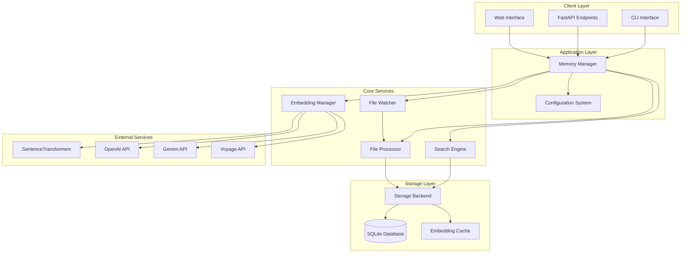
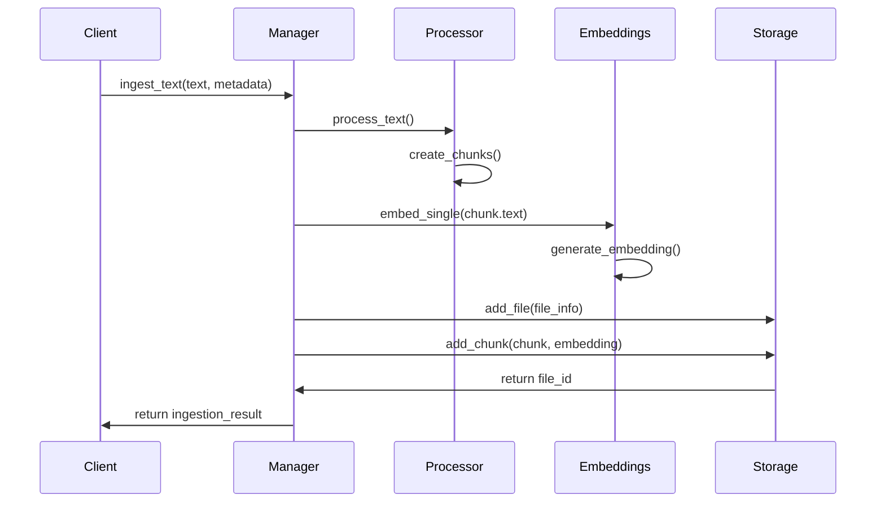
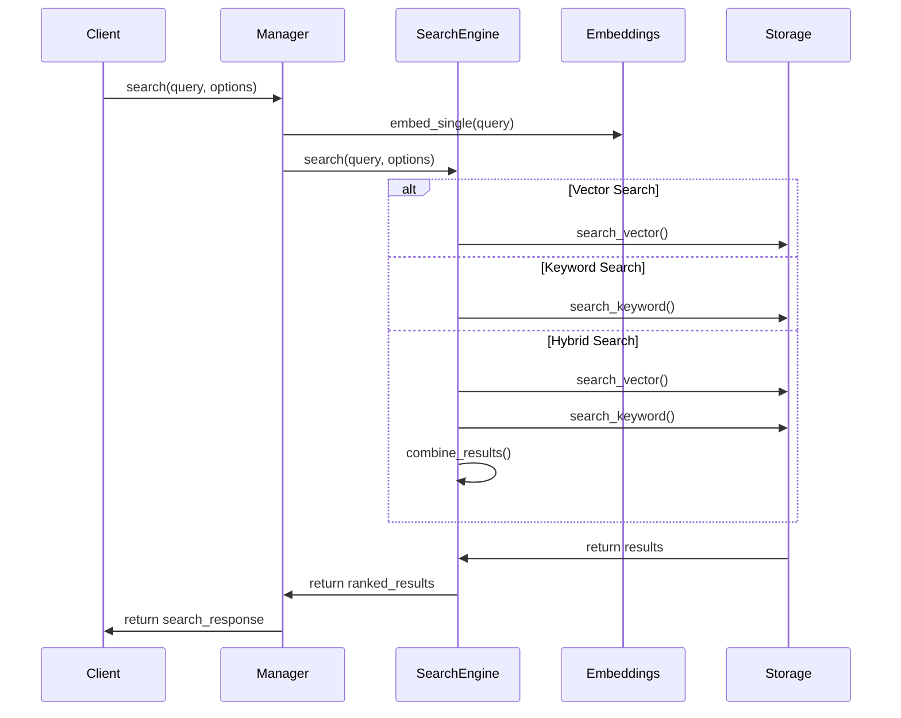

# Memory System Architecture Overview

## 🏗️ **System Architecture**

The memory system is built as a modular, scalable architecture that integrates seamlessly with the existing FastAPI application while providing powerful semantic search capabilities.

## 📊 **Architecture Diagram**



## 🧩 **Component Architecture**

### **1. Memory Manager (`memory/manager.py`)**
**Role**: Central orchestrator and facade for all memory operations

**Responsibilities**:
- Component lifecycle management
- API coordination
- Configuration management
- Error handling and logging

**Key Methods**:
- `search()` - Unified search interface
- `ingest_text()` - Text ingestion
- `ingest_file()` - File ingestion
- `get_status()` - System health and metrics
- `sync_files()` - File synchronization

### **2. Storage Backend (`memory/storage/`)**
**Role**: Persistent data storage and retrieval

**Components**:
- **SQLiteBackend**: Primary storage implementation
- **MemoryBackend**: In-memory storage for testing
- **Base Interface**: Pluggable storage architecture

**Features**:
- File and chunk management
- Embedding storage and caching
- Full-text search indexing (FTS5)
- Vector search capabilities
- Foreign key relationships

### **3. Embedding Manager (`memory/embeddings/`)**
**Role**: Multi-provider embedding generation and management

**Providers**:
- **SentenceTransformers**: Local embedding generation
- **OpenAI**: Cloud-based embeddings
- **Gemini**: Google's embedding service
- **Voyage**: Specialized embedding provider

**Features**:
- Automatic provider fallback
- Embedding caching
- Batch processing
- Health monitoring

### **4. Search Engine (`memory/search/`)**
**Role**: Multi-modal search capabilities

**Components**:
- **VectorSearch**: Semantic similarity search
- **KeywordSearch**: BM25 full-text search
- **HybridSearch**: Combined search with result fusion

**Algorithms**:
- Cosine similarity for vector search
- BM25 ranking for keyword search
- Weighted score fusion for hybrid results

### **5. File Processing (`memory/processing/`)**
**Role**: File ingestion and content processing

**Components**:
- **FileProcessor**: File parsing and chunking
- **TextChunker**: Basic text chunking
- **MarkdownChunker**: Structure-aware markdown processing
- **FileWatcher**: Real-time file monitoring

**Features**:
- Multiple file format support
- Intelligent chunking strategies
- Metadata extraction
- Real-time change detection

### **6. Configuration (`memory/config.py`)**
**Role**: System configuration and settings management

**Features**:
- Constitution-based configuration
- Environment variable support
- Pydantic validation
- API key management

## 🔧 **Technical Implementation Details**

### **Database Schema**
```sql
-- Files table
CREATE TABLE files (
    id TEXT PRIMARY KEY,
    path TEXT UNIQUE NOT NULL,
    hash TEXT NOT NULL,
    size INTEGER NOT NULL,
    mtime REAL NOT NULL,
    metadata TEXT DEFAULT '{}',
    created_at REAL NOT NULL,
    updated_at REAL NOT NULL
);

-- Chunks table
CREATE TABLE chunks (
    rowid INTEGER PRIMARY KEY AUTOINCREMENT,
    id TEXT UNIQUE NOT NULL,
    file_id TEXT NOT NULL,
    text TEXT NOT NULL,
    embedding BLOB,
    start_char INTEGER NOT NULL,
    end_char INTEGER NOT NULL,
    metadata TEXT DEFAULT '{}',
    created_at REAL NOT NULL,
    FOREIGN KEY (file_id) REFERENCES files(id) ON DELETE CASCADE
);

-- Full-text search index
CREATE VIRTUAL TABLE chunks_fts USING fts5(
    text,
    content='chunks',
    content_rowid='rowid'
);

-- Embedding cache
CREATE TABLE embedding_cache (
    hash TEXT PRIMARY KEY,
    provider TEXT NOT NULL,
    model TEXT NOT NULL,
    embedding BLOB NOT NULL,
    created_at REAL NOT NULL
);
```

### **Search Algorithm Implementation**

#### **Vector Search**
```python
async def vector_search(query_embedding, limit=10, min_score=0.0):
    # 1. Retrieve all embeddings from database
    # 2. Compute cosine similarity with query
    # 3. Rank by similarity score
    # 4. Apply score threshold
    # 5. Return top-k results

    similarity = cosine_similarity(query_embedding, stored_embedding)
    return sorted_results[:limit]
```

#### **Keyword Search**
```python
async def keyword_search(query, limit=10, min_score=0.0):
    # 1. Use SQLite FTS5 for fast text search
    # 2. Apply BM25 ranking algorithm
    # 3. Normalize scores to 0-1 range
    # 4. Apply score threshold
    # 5. Return ranked results

    sql = "SELECT *, bm25(chunks_fts) as score FROM chunks_fts WHERE chunks_fts MATCH ?"
    return execute_search(sql, query)
```

#### **Hybrid Search**
```python
async def hybrid_search(query, vector_weight=0.7, keyword_weight=0.3):
    # 1. Run vector and keyword searches in parallel
    # 2. Normalize scores to comparable ranges
    # 3. Apply weighted combination
    # 4. Remove duplicates with score fusion
    # 5. Re-rank combined results

    vector_results = await vector_search(query)
    keyword_results = await keyword_search(query)

    combined_score = (vector_weight * vector_score +
                     keyword_weight * keyword_score)
    return ranked_results
```

## 🎯 **Design Principles**

### **1. Modularity**
- Each component has a single responsibility
- Clear interfaces between components
- Pluggable architecture for easy extension

### **2. Scalability**
- Efficient database design with proper indexing
- Batch processing for embeddings
- Configurable resource limits

### **3. Reliability**
- Comprehensive error handling
- Graceful degradation (fallback providers)
- Health monitoring and status reporting

### **4. Performance**
- Lazy loading and initialization
- Embedding caching
- Optimized search algorithms

### **5. Extensibility**
- Abstract base classes for easy extension
- Configuration-driven behavior
- Plugin architecture for new providers

## 🔄 **Data Flow**

### **Text Ingestion Flow**


### **Search Flow**


## 🔍 **Quality Assurance**

### **Testing Strategy**
- Unit tests for individual components
- Integration tests for component interaction
- Performance benchmarks
- Quality metrics for search results

### **Monitoring**
- Health check endpoints
- Performance metrics
- Error rate tracking
- Search quality monitoring

### **Logging**
- Structured logging with JSON format
- Different log levels (DEBUG, INFO, WARNING, ERROR)
- Component-specific logging
- Performance timing logs

## 🚀 **Deployment Architecture**

### **Single Instance Deployment**
```
┌─────────────────┐
│   FastAPI App   │
├─────────────────┤
│ Memory Manager  │
├─────────────────┤
│ SQLite Database │
├─────────────────┤
│   File System   │
└─────────────────┘
```

### **Distributed Deployment** (Future)
```
┌─────────────┐    ┌─────────────┐    ┌─────────────┐
│ FastAPI #1  │    │ FastAPI #2  │    │ FastAPI #3  │
└─────────────┘    └─────────────┘    └─────────────┘
       │                   │                   │
       └───────────────────┼───────────────────┘
                           │
              ┌─────────────────┐
              │   PostgreSQL    │
              │  (with pgvector) │
              └─────────────────┘
```

## 🔮 **Future Enhancements**

### **Short Term**
- Fix file ingestion foreign key issue
- Add vector extension for faster search
- Improve error handling and recovery

### **Medium Term**
- PostgreSQL backend with pgvector
- Distributed deployment support
- Advanced search features (filters, facets)

### **Long Term**
- Machine learning relevance tuning
- Multi-modal search (text + images)
- Real-time streaming ingestion