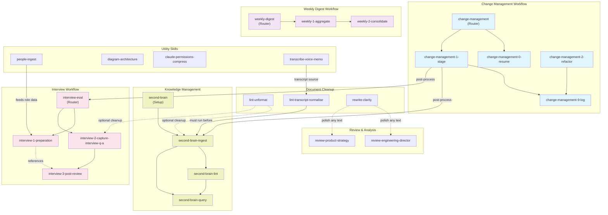

# Claude Code Skills Library

A collection of reusable skills for Claude Code that extend capabilities across document processing, knowledge management, interviews, code review, and workflow automation.

## Overview

This folder contains custom skills that can be symlinked to your Claude Code installation to add specialized functionality. Each skill is self-contained with its own configuration, scripts, and documentation.

## Installation

### Quick Start

Use the included `link-skills.sh` script to symlink skills to your Claude Code skills folder:

```bash
# Link a single skill to the default location (~/.claude/skills)
./link-skills.sh second-brain

# Link multiple skills using wildcards
./link-skills.sh "second-brain*"

# Link to a custom location
./link-skills.sh lint-unformat /path/to/custom/skills
```

### Recommendation

```
# Link all change management with git
./link-skills.sh "change-management*"

# Voice capture & Transcript
./link-skills.sh "lint-unformat"
./link-skills.sh "lint-transcript-normalise"
./link-skills.sh "transcribe-voice-memo"

# Writing mgmt
./link-skills.sh "rewrite-clarity"
./link-skills.sh "review-*"

# (Optional) if you need a lot of diagramming
./link-skills.sh "diagram-architecture"
```

### Manual Installation

1. Identify the skill folder you want to install (e.g., `second-brain`)

2. Create a symlink from this folder to your Claude Code skills directory:

   ```bash
   # Default Claude Code skills location
   ln -s /path/to/agents-os-frtu/skills/second-brain ~/.claude/skills/second-brain

   # Or to a custom location
   ln -s /path/to/agents-os-frtu/skills/second-brain /custom/path/skills/second-brain
   ```

3. Verify the symlink works:

   ```bash
   ls -la ~/.claude/skills/  # Should show your linked skills
   ```

## Skill Dependencies

Skills are organized into workflows and interconnected pipelines. Quick reference tree:

```text
Workflows & Dependencies
├── Change Management
│   ├── change-management (Router)
│   ├── ├─ change-management-0-resume (Optional)
│   ├── ├─ change-management-1-stage (Stage)
│   ├── │  └─ change-management-9-log (Commit)
│   ├── └─ change-management-2-refactor (Refactor)
│   │     └─ change-management-9-log (Commit)
│
├── Knowledge Management (Second Brain)
│   ├── second-brain (Setup)
│   └─ second-brain-ingest (Ingest)
│      ├─ second-brain-lint (Health check)
│      └─ second-brain-query (Search & synthesize)
│
├── Document Processing
│   ├── transcribe-voice-memo
│   │  └─ lint-transcript-normalise (Normalize)
│   │     └─ second-brain-ingest (Ingest) [Optional]
│   ├── lint-unformat (Clean formatting)
│   │  ├─ second-brain-ingest [Optional]
│   │  └─ interview-2-capture-interview-q-a [Optional]
│   └── rewrite-clarity (Polish)
│      ├─ review-engineering-director
│      └─ review-product-strategy
│
├── Interview Workflow
│   ├── interview-eval (Router)
│   ├── ├─ interview-1-preparation (Prep)
│   ├── ├─ interview-2-capture-interview-q-a (Capture)
│   ├── └─ interview-3-post-review (Evaluate)
│   └── people-ingest (Feeds role data to prep)
│
├── Weekly Digest
│   ├── weekly-digest (Router)
│   ├─ weekly-1-aggregate (Phase 1)
│   └─ weekly-2-consolidate (Phase 2)
│
├── Review & Analysis
│   ├── review-engineering-director (Director lens)
│   └── review-product-strategy (Product lens)
│
└── Utilities
    ├── claude-permissions-compress
    ├── diagram-architecture
    ├── people-ingest
    └── transcribe-voice-memo
```

### Dependency Legend

- **→ or ├─** — Hard dependency; must run in order
- **[Optional]** — Can enhance but isn't required
- **Router** — Coordinates sub-skills in sequence
- **Feeds to** — Provides input/context to downstream skill

## Skills Library

### Change Management Workflow

A multi-step workflow for staging, refactoring, and committing changes to git repositories.

- **[change-management](./change-management/)** — Router for multi-step change workflows. Stages files, refactors paths, and logs changes.
- **[change-management-0-resume](./change-management-0-resume/)** — Optional first step. Reads recent git history to reconstruct what was previously done.
- **[change-management-1-stage](./change-management-1-stage/)** — Stage git changes via `git add`.
- **[change-management-2-refactor](./change-management-2-refactor/)** — Refactor file paths using `git mv` while preserving git history.
- **[change-management-9-log](./change-management-9-log/)** — Final step. Creates structured commit messages and appends to wiki/log.md.

### Knowledge Management (Second Brain)

Build and maintain an Obsidian-based knowledge base with LLM assistance.

- **[second-brain](./second-brain/)** — Set up a new Obsidian knowledge base with the LLM Wiki pattern. Interactive wizard for vault configuration.
- **[second-brain-ingest](./second-brain-ingest/)** — Process raw source documents into wiki pages.
- **[second-brain-lint](./second-brain-lint/)** — Health-check the wiki for contradictions, orphan pages, stale claims, and missing cross-references.
- **[second-brain-query](./second-brain-query/)** — Answer questions against the knowledge base wiki and explore connections between topics.

### Document Linting & Formatting

Clean up and normalize various document formats and sources.

- **[lint-unformat](./lint-unformat/)** — Clean up Slack formatting, emoji images, Zoom speaker images, whitespace issues, code blocks, and missing wikilinks. Includes table alignment and auto-linking features.
- **[lint-transcript-normalise](./lint-transcript-normalise/)** — Pre-ingest cleanup for auto-generated transcripts (Whisper/Zoom). Resolves garbled proper nouns against a JSON correction dictionary.
- **[rewrite-clarity](./rewrite-clarity/)** — Apply Amazon-style clear writing rules to documents. Remove weasel words and improve clarity with data-driven language.

### Interview Workflow

End-to-end candidate evaluation from preparation through final assessment.

- **[interview-eval](./interview-eval/)** — Main interview evaluation workflow router.
- **[interview-1-preparation](./interview-1-preparation/)** — Pre-interview preparation. Creates candidate source page with profile analysis, strengths/concerns, and tailored questions.
- **[interview-2-capture-interview-q-a](./interview-2-capture-interview-q-a/)** — Capture interview transcripts into linked Q&A notes and condensed interview reports.
- **[interview-3-post-review](./interview-3-post-review/)** — Post-interview evaluation. Creates structured evaluation page with scores, evidence, and recommendations.

### Review & Analysis Skills

Critical reviews from different perspectives (engineering, product, etc.).

- **[review-engineering-director](./review-engineering-director/)** — Act as a seasoned Engineering Director. Adversarially pressure-test proposals, board updates, promotion packets, and funding asks. Focuses on ROI, developer velocity, stability, and cost-efficiency.
- **[review-product-strategy](./review-product-strategy/)** — Review documents through the lens of product strategy.

### Utility Skills

Miscellaneous tools for specific tasks.

- **[claude-permissions-compress](./claude-permissions-compress/)** — Interactively compress Claude Code permissions files (settings.local.json). Groups entries by topic with danger ratings.
- **[diagram-architecture](./diagram-architecture/)** — Generate architecture or integration diagrams using Mermaid syntax. Convert existing diagrams (PNG/JPG/SVG) to Mermaid.
- **[people-ingest](./people-ingest/)** — Process people-related sources (career ladders, competencies, SDLC documents) into structured wiki pages.
- **[transcribe-voice-memo](./transcribe-voice-memo/)** — Transcribe Apple Voice Memos using Whisper. Supports batch processing with language selection.

### Weekly Digest Workflow

Two-phase workflow for aggregating and consolidating weekly team updates.

- **[weekly-digest](./weekly-digest/)** — Router for the two-phase weekly digest workflow.
- **[weekly-1-aggregate](./weekly-1-aggregate/)** — Phase 1: Aggregate contributor updates into per-product wiki pages.
- **[weekly-2-consolidate](./weekly-2-consolidate/)** — Phase 2: Consolidate per-product pages into a single Slack-ready report.

## Skill Anatomy

Each skill folder contains:

```text
skill-name/
├── SKILL.md              # Skill metadata and documentation
├── scripts/              # Implementation scripts and handlers
│   ├── main.md           # Entry point (executed when skill is invoked)
│   └── *.py/*.sh         # Supporting scripts
└── references/           # Templates, examples, and reference materials
```

### SKILL.md Structure

The `SKILL.md` file contains YAML frontmatter with:

- **name** — Skill identifier (used by Claude Code)
- **description** — When to use this skill (triggers for skill invocation)
- **allowed-tools** — Tools this skill is permitted to use
- **version** — Semantic version
- **compatibility** — Any system requirements
- **metadata** — Additional configuration

## Script Usage Reference

### link-skills.sh

```bash
./link-skills.sh [SKILL_NAME_PATTERN] [TARGET_SKILLS_DIR]

Arguments:
  SKILL_NAME_PATTERN  - Name of skill(s) to link. Supports wildcards (e.g., "second-brain*")
  TARGET_SKILLS_DIR   - (Optional) Target directory for symlinks.
                        Defaults to ~/.claude/skills

Examples:
  ./link-skills.sh second-brain
  ./link-skills.sh "second-brain*"
  ./link-skills.sh lint-unformat ~/custom/skills
```

## Claude Skills Directory Structure

Once symlinked, your Claude Code skills directory structure looks like:

```text
~/.claude/skills/
├── second-brain/          (symlink to agents-os-frtu/skills/second-brain)
├── second-brain-ingest/   (symlink to agents-os-frtu/skills/second-brain-ingest)
├── lint-unformat/         (symlink to agents-os-frtu/skills/lint-unformat)
└── ... (other symlinked skills)
```

## Common Workflows

### Setting Up a Second Brain

```bash
./link-skills.sh "second-brain*"
# Then use /second-brain in Claude Code to initialize vault
```

### Processing Interview Candidates

```bash
./link-skills.sh "interview*"
# Then use /interview-eval in Claude Code
```

### Document Cleanup Pipeline

```bash
./link-skills.sh "lint*"
# Use /lint-unformat for formatting, /lint-transcript-normalise for transcripts
```

### Weekly Team Reports

```bash
./link-skills.sh "weekly*"
# Use /weekly-digest in Claude Code for full pipeline
```


## Skill internal details
### Detailed Dependency Diagram

For a comprehensive visual map of all interconnections, see the diagram below:



## Troubleshooting

### Symlink Issues

**"File exists" error when linking:**

```bash
# Check if skill is already linked
ls -la ~/.claude/skills/skill-name

# Remove old symlink if needed
rm ~/.claude/skills/skill-name
./link-skills.sh skill-name
```

**Symlink points to wrong location:**

```bash
# Verify symlink target
readlink ~/.claude/skills/skill-name

# Recreate if necessary
rm ~/.claude/skills/skill-name
./link-skills.sh skill-name /correct/path
```

### Skill Not Found in Claude Code

1. Verify symlink is in correct location: `ls ~/.claude/skills/`
2. Ensure `SKILL.md` exists in the skill folder
3. Restart Claude Code to reload skill cache
4. Check that the skill name in `SKILL.md` matches the folder name

## Contributing

To add a new skill:

1. Create a new folder following the naming convention
2. Add a `SKILL.md` with proper frontmatter
3. Create `scripts/main.md` as the entry point
4. Document in this README under the appropriate category
5. Test with `./link-skills.sh new-skill-name`

## Resources

- [Claude Code Documentation](https://github.com/anthropics/claude-code)
- [Skill Development Guide](./SKILL.md) (template)
- [Obsidian](https://obsidian.md/) — Knowledge base platform
- [Mermaid Diagrams](https://mermaid.js.org/) — Diagram syntax

## License

These skills are provided as-is for use with Claude Code.
