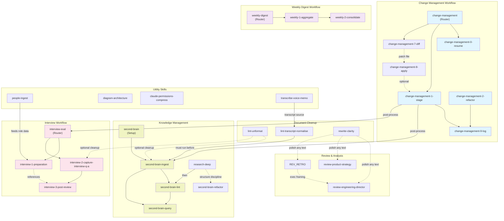

# Claude Code Skills Library

A collection of reusable skills for Claude Code that extend capabilities across document processing, knowledge management, interviews, code review, and workflow automation.

## Overview

This folder contains custom skills that can be symlinked to your Claude Code installation to add specialized functionality. Each skill is self-contained with its own configuration, scripts, and documentation.

## Installation

### Quick Start

Use the included `link-skills.sh` script to symlink skills to your Claude Code skills folder:

```bash
# Link a single skill to the default location (~/.claude/skills)
./link-skills.sh second-brain

# Link multiple skills using wildcards
./link-skills.sh "second-brain*"

# Link to a custom location
./link-skills.sh lint-unformat /path/to/custom/skills
```

### Recommendation

```
# Link all change management with git
./link-skills.sh "change-management*"

# Voice capture & Transcript
./link-skills.sh "lint-unformat"
./link-skills.sh "lint-transcript-normalise"
./link-skills.sh "transcribe-voice-memo"

# Writing mgmt
./link-skills.sh "rewrite-clarity"
./link-skills.sh "review-*"

# (Optional) if you need a lot of diagramming
./link-skills.sh "diagram-architecture"
```

### Manual Installation

1. Identify the skill folder you want to install (e.g., `second-brain`)

2. Create a symlink from this folder to your Claude Code skills directory:

   ```bash
   # Default Claude Code skills location
   ln -s /path/to/agents-os-frtu/skills/second-brain ~/.claude/skills/second-brain

   # Or to a custom location
   ln -s /path/to/agents-os-frtu/skills/second-brain /custom/path/skills/second-brain
   ```

3. Verify the symlink works:

   ```bash
   ls -la ~/.claude/skills/  # Should show your linked skills
   ```

## Skill Dependencies

Skills are organized into workflows and interconnected pipelines. Quick reference tree:

```text
Workflows & Dependencies
├── Change Management
│   ├── change-management (Router)
│   ├── ├─ change-management-0-resume (Optional)
│   ├── ├─ change-management-1-stage (Stage)
│   ├── │  └─ change-management-9-log (Commit)
│   ├── ├─ change-management-2-refactor (Refactor)
│   ├── │  └─ change-management-9-log (Commit)
│   ├── ├─ change-management-7-diff (Export patch)
│   ├── └─ change-management-8-apply (Apply patch)
│   │     └─ change-management-1-stage [Optional]
│
├── Knowledge Management (Second Brain)
│   ├── second-brain (Setup)
│   ├─ second-brain-ingest (Ingest)
│   │  ├─ second-brain-lint (Health check)
│   │  └─ second-brain-query (Search & synthesize)
│   └─ second-brain-refactor (Split a folder into subcategories)
│
├── Document Processing
│   ├── transcribe-voice-memo
│   │  └─ lint-transcript-normalise (Normalize)
│   │     └─ second-brain-ingest (Ingest) [Optional]
│   ├── lint-unformat (Clean formatting)
│   │  ├─ second-brain-ingest [Optional]
│   │  └─ interview-2-capture-interview-q-a [Optional]
│   └── rewrite-clarity (Polish)
│      ├─ review-engineering-director
│      └─ review-product-strategy
│
├── Interview Workflow
│   ├── interview-eval (Router)
│   ├── ├─ interview-1-preparation (Prep)
│   ├── ├─ interview-2-capture-interview-q-a (Capture)
│   ├── └─ interview-3-post-review (Evaluate)
│   └── people-ingest (Feeds role data to prep)
│
├── Weekly Digest
│   ├── weekly-digest (Router)
│   ├─ weekly-1-aggregate (Phase 1)
│   └─ weekly-2-consolidate (Phase 2)
│
├── Review & Analysis
│   ├── review-engineering-director (Director lens)
│   │  └─ rewrite-clarity (Delegated word-level pass)
│   └── review-product-strategy (Product lens)
│
└── Utilities
    ├── claude-permissions-compress
    ├── diagram-architecture
    ├── people-ingest
    └── transcribe-voice-memo
```

### Dependency Legend

- **→ or ├─** — Hard dependency; must run in order
- **[Optional]** — Can enhance but isn't required
- **Router** — Coordinates sub-skills in sequence
- **Feeds to** — Provides input/context to downstream skill

## Skills Library

### Change Management Workflow

A multi-step workflow for staging, refactoring, and committing changes to git repositories.

- **[change-management](./change-management/)** — Router for multi-step change workflows. Stages files, refactors paths, and logs changes.
- **[change-management-0-resume](./change-management-0-resume/)** — Optional first step. Reads recent git history to reconstruct what was previously done.
- **[change-management-1-stage](./change-management-1-stage/)** — Stage git changes via `git add`.
- **[change-management-2-refactor](./change-management-2-refactor/)** — Refactor file paths using `git mv` while preserving git history.
- **[change-management-7-diff](./change-management-7-diff/)** — Export current changes (staged, else unstaged) to a patch file. See [`CHANGE_MANAGEMENT_REPO_PATH`](#patch-file-directory-change_management_repo_path).
- **[change-management-8-apply](./change-management-8-apply/)** — Apply a patch file to the local repository.
- **[change-management-9-log](./change-management-9-log/)** — Final step. Creates structured commit messages and appends to wiki/log.md.

### Knowledge Management (Second Brain)

Build and maintain an Obsidian-based knowledge base with LLM assistance.

- **[second-brain](./second-brain/)** — Set up a new Obsidian knowledge base with the LLM Wiki pattern. Interactive wizard for vault configuration.
- **[second-brain-ingest](./second-brain-ingest/)** — Process raw source documents into wiki pages.
- **[second-brain-lint](./second-brain-lint/)** — Health-check the wiki for contradictions, orphan pages, stale claims, and missing cross-references.
- **[second-brain-query](./second-brain-query/)** — Answer questions against the knowledge base wiki and explore connections between topics.
- **[second-brain-refactor](./second-brain-refactor/)** — Split a wiki folder into subcategories when a new taxonomy is needed.

### Document Linting & Formatting

Clean up and normalize various document formats and sources.

- **[lint-unformat](./lint-unformat/)** — Clean up Slack formatting, emoji images, Zoom speaker images, whitespace issues, code blocks, and missing wikilinks. Includes table alignment and auto-linking features.
- **[lint-transcript-normalise](./lint-transcript-normalise/)** — Pre-ingest cleanup for auto-generated transcripts (Whisper/Zoom). Resolves garbled proper nouns against a JSON correction dictionary.
- **[rewrite-clarity](./rewrite-clarity/)** — Apply Amazon-style clear writing rules to documents. Remove weasel words and improve clarity with data-driven language.

### Interview Workflow

End-to-end candidate evaluation from preparation through final assessment.

- **[interview-eval](./interview-eval/)** — Main interview evaluation workflow router.
- **[interview-1-preparation](./interview-1-preparation/)** — Pre-interview preparation. Creates candidate source page with profile analysis, strengths/concerns, and tailored questions.
- **[interview-2-capture-interview-q-a](./interview-2-capture-interview-q-a/)** — Capture interview transcripts into linked Q&A notes and condensed interview reports.
- **[interview-3-post-review](./interview-3-post-review/)** — Post-interview evaluation. Creates structured evaluation page with scores, evidence, and recommendations.

### Review & Analysis Skills

Critical reviews from different perspectives (engineering, product, etc.).

- **[review-engineering-director](./review-engineering-director/)** — Act as a seasoned Engineering Director. Adversarially pressure-test proposals, board updates, promotion packets, and funding asks. Focuses on ROI, developer velocity, stability, and cost-efficiency.
- **[review-product-strategy](./review-product-strategy/)** — Review documents through the lens of product strategy.

### Utility Skills

Miscellaneous tools for specific tasks.

- **[claude-permissions-compress](./claude-permissions-compress/)** — Interactively compress Claude Code permissions files (settings.local.json). Groups entries by topic with danger ratings.
- **[diagram-architecture](./diagram-architecture/)** — Generate architecture or integration diagrams using Mermaid syntax. Convert existing diagrams (PNG/JPG/SVG) to Mermaid.
- **[people-ingest](./people-ingest/)** — Process people-related sources (career ladders, competencies, SDLC documents) into structured wiki pages.
- **[transcribe-voice-memo](./transcribe-voice-memo/)** — Transcribe Apple Voice Memos using Whisper. Supports batch processing with language selection.

### Weekly Digest Workflow

Two-phase workflow for aggregating and consolidating weekly team updates.

- **[weekly-digest](./weekly-digest/)** — Router for the two-phase weekly digest workflow.
- **[weekly-1-aggregate](./weekly-1-aggregate/)** — Phase 1: Aggregate contributor updates into per-product wiki pages.
- **[weekly-2-consolidate](./weekly-2-consolidate/)** — Phase 2: Consolidate per-product pages into a single Slack-ready report.

## Skill Internal Structure & Composition

This section is the **skill factory** convention: how a skill is laid out, and how skills reuse each other instead of copying content. Agents creating or changing a skill follow [`AGENTS.md`](./AGENTS.md), which builds on this section.

### Folder layout

Only `SKILL.md` is required. Add the other folders when the skill needs them:

```text
skill-name/
├── SKILL.md                  # Required. Frontmatter + the process the agent follows
├── references/               # Loaded on demand, never all up front
│   ├── templates/            # Generic output structures (report, doc, page)
│   │   └── {artifact}.md
│   ├── cases/                # Specific instances: teams, failure shapes, worked examples
│   │   ├── README.md         # Registry: index table + rules for adding a case
│   │   └── {letter}-{slug}.md
│   └── {topic}.md            # Methodology, schema, rules, patterns
├── scripts/                  # Deterministic work (Python/shell) + tests (test_*.py)
└── config/                   # Data the scripts read (JSON dictionaries, thresholds)
```

| Skill | What it shows |
| --- | --- |
| `review-engineering-director` | `templates/` + `cases/` (failure shapes) with a registry; delegates to `rewrite-clarity` |
| `lint-unformat`, `diagram-architecture` | `scripts/` with a test file next to each script |
| `lint-transcript-normalise` | `config/corrections.json` read by a script |
| `change-management`, `interview-eval`, `weekly-digest` | Router + numbered sub-skills |

### SKILL.md frontmatter

```yaml
---
name: skill-name                 # must match the folder name
description: >                   # WHAT it does + WHEN to use it (trigger phrases in quotes)
  Produce or review X. Use when the user says "…", "…", or shares a …
allowed-tools: Bash Read Glob Grep Edit Write   # add Skill if it invokes other skills
version: 0.1.0                   # optional, bump on behaviour change
---
```

The `description` is the only part the harness always sees. It decides when the skill triggers, so list the trigger phrases and say how the skill differs from its neighbours (e.g. `research-deep` vs `second-brain-ingest`).

### SKILL.md body — recommended sections

1. **Purpose / posture:** 2–3 lines on what good output looks like.
2. **Files:** which `references/` files exist and **when to load each one**.
3. **Determine the mode:** e.g. Produce vs Review. Ask one question if unclear.
4. **Process:** numbered steps.
5. **Output format:** a fenced skeleton of the deliverable.
6. **Rules / boundaries:** including hand-offs to other skills.
7. **Chaining:** what runs next (e.g. `/change-management-1-stage`).

Keep `SKILL.md` about **process**. Put long content (templates, methodology, examples) in `references/` so it only loads when needed.

### Generic vs specific: template + case registry

When a skill applies one structure to many subjects (teams, doc types, failure shapes):

- `references/templates/{artifact}.md` stays **generic**. It has no team names, systems or real numbers. For each section it gives the **insight to deliver**, the **style & format**, and the **questions to answer**.
- `references/cases/{letter}-{slug}.md` holds the **specifics**: one file per team or per failure shape.
- `references/cases/README.md` is the **registry**: an index table (case → shape/team → file) plus the rules for adding a case. New cases only add a file and a row; `SKILL.md` doesn't change.
- `SKILL.md` says: *read the registry, then load only the matching case.*
- If a finding recurs across cases, move it into the template as a generic rule.

### Reuse between skills — compose, don't copy

Pick the first option that works:

| # | Mechanism | Use when | How | Example |
| --- | --- | --- | --- | --- |
| 1 | **Invoke a sub-skill** | Another skill already does the job (a behaviour, a pass, a step) | Name it in the process: *"run `/rewrite-clarity` on the result"*. Add `Skill` to `allowed-tools` if it runs automatically | `review-engineering-director` → `rewrite-clarity`; ingest/interview → `change-management-1-stage` |
| 2 | **Router + numbered sub-skills** | A workflow has ordered phases that are each useful alone | Router skill `{family}`, steps `{family}-{n}-{verb}`; the router only sequences and passes parameters | `weekly-digest` → `weekly-1-aggregate` → `weekly-2-consolidate` |
| 3 | **Division of labour** | Two skills work on the same doc at different levels | A table in both skills: who owns what, and in which order they run | `review-engineering-director` (judgement) vs `rewrite-clarity` (words) |
| 4 | **Point to the owning skill's reference** | You need the same schema or template, not the same behaviour | Link it by skill name + path (`second-brain/references/wiki-schema.md`) and say "read from"; both skills must be linked | wiki schema shared across `second-brain*` |
| 5 | **Copy** | Last resort only, e.g. a script that must run without the other skill installed | Add a header comment `# Copied from {skill}/{path} — keep in sync` | ⚠️ `second-brain/scripts/relink-wiki.py` and `lint-unformat/scripts/relink-wiki.py` have already **drifted** apart |

Rules:

- **One owner per piece of content.** Each rule, template or script lives in exactly one skill. Others invoke it or link to it.
- **Declare the dependency.** Every invoke/link edge is added to [Skill Dependencies](#skill-dependencies) (tree + Mermaid), and the dependent skill says it needs the other one linked.
- **Hand off, don't re-implement.** If a step belongs to another skill, name that skill and stop. Don't copy its rules.
- **Reuse only IF relevant.** Don't add a dependency for a one-line overlap. A small, self-contained skill is better than a forced composition.

### Naming conventions

| Pattern | Meaning | Example |
| --- | --- | --- |
| `{family}` | Router or entry point | `change-management`, `weekly-digest` |
| `{family}-{n}-{verb}` | Ordered step; gaps leave room (`0` optional first, `9` final) | `change-management-9-log` |
| `review-{lens}` | Critique or produce through a lens | `review-product-strategy` |
| `lint-{target}` | Deterministic clean-up, script-backed | `lint-unformat` |
| `rewrite-{goal}` | Word-level rewrite | `rewrite-clarity` |
| `{domain}-{verb}` | Standalone utility | `people-ingest`, `transcribe-voice-memo` |

### Git

The root `.gitignore` ignores `SKILL.md`, so a new skill's `SKILL.md` has to be force-added: `git add -f {skill}/SKILL.md` (every tracked skill was added this way).

## Script Usage Reference

### link-skills.sh

```bash
./link-skills.sh [SKILL_NAME_PATTERN] [TARGET_SKILLS_DIR]

Arguments:
  SKILL_NAME_PATTERN  - Name of skill(s) to link. Supports wildcards (e.g., "second-brain*")
  TARGET_SKILLS_DIR   - (Optional) Target directory for symlinks.
                        Defaults to ~/.claude/skills

Examples:
  ./link-skills.sh second-brain
  ./link-skills.sh "second-brain*"
  ./link-skills.sh lint-unformat ~/custom/skills
```

## Claude Skills Directory Structure

Once symlinked, your Claude Code skills directory structure looks like:

```text
~/.claude/skills/
├── second-brain/          (symlink to agents-os-frtu/skills/second-brain)
├── second-brain-ingest/   (symlink to agents-os-frtu/skills/second-brain-ingest)
├── lint-unformat/         (symlink to agents-os-frtu/skills/lint-unformat)
└── ... (other symlinked skills)
```

## Common Workflows

### Setting Up a Second Brain

```bash
./link-skills.sh "second-brain*"
# Then use /second-brain in Claude Code to initialize vault
```

### Processing Interview Candidates

```bash
./link-skills.sh "interview*"
# Then use /interview-eval in Claude Code
```

### Document Cleanup Pipeline

```bash
./link-skills.sh "lint*"
# Use /lint-unformat for formatting, /lint-transcript-normalise for transcripts
```

### Weekly Team Reports

```bash
./link-skills.sh "weekly*"
# Use /weekly-digest in Claude Code for full pipeline
```


## Skill internal details
### Detailed Dependency Diagram

For a comprehensive visual map of all interconnections, see the diagram below:



## Environment Variables

Some skills read shared environment variables to avoid repeating configuration on every invocation. Set these in your shell profile (`~/.zshrc`, `~/.bashrc`) or in a `.env` file sourced before starting Claude Code.

| Variable | Used by | Purpose | Default |
|----------|---------|---------|---------|
| `CHANGE_MANAGEMENT_REPO_PATH` | `change-management-7-diff`, `change-management-8-apply` | Persistent directory where patch files are written and read. Lets you share patches across projects or keep them outside the repo. | `.` (current working directory) |

### Patch file directory (`CHANGE_MANAGEMENT_REPO_PATH`)

Both diff/apply skills use the same three-tier precedence:

1. **Ephemeral parameter** (`output_path` / `patch_dir`) — per-invocation override.
2. **`CHANGE_MANAGEMENT_REPO_PATH`** — durable env var; set once, applies to every invocation.
3. **Current folder** (`.`) — fallback when neither above is configured.

```bash
# Add to ~/.zshrc or ~/.bashrc
export CHANGE_MANAGEMENT_REPO_PATH=~/patches

# Then patch round-trips just work:
# /change-management-7-diff            → writes ~/patches/20260909-143052.patch
# /change-management-8-apply 20260909-143052.patch  → reads ~/patches/20260909-143052.patch
```

A copy of this table is in [`skills/.env.example`](./.env.example).

## Troubleshooting

### Symlink Issues

**"File exists" error when linking:**

```bash
# Check if skill is already linked
ls -la ~/.claude/skills/skill-name

# Remove old symlink if needed
rm ~/.claude/skills/skill-name
./link-skills.sh skill-name
```

**Symlink points to wrong location:**

```bash
# Verify symlink target
readlink ~/.claude/skills/skill-name

# Recreate if necessary
rm ~/.claude/skills/skill-name
./link-skills.sh skill-name /correct/path
```

### Skill Not Found in Claude Code

1. Verify symlink is in correct location: `ls ~/.claude/skills/`
2. Ensure `SKILL.md` exists in the skill folder
3. Restart Claude Code to reload skill cache
4. Check that the skill name in `SKILL.md` matches the folder name

## Contributing

To add a new skill, follow the skill factory checklist in [`AGENTS.md`](./AGENTS.md). In short:

1. Check the [Skills Library](#skills-library): extend or compose an existing skill before creating a new one.
2. Create `{name}/SKILL.md` following [Skill Internal Structure & Composition](#skill-internal-structure--composition).
3. Add it to the Skills Library, [Skill Dependencies](#skill-dependencies) (tree + Mermaid) and, if relevant, [Recommendation](#recommendation).
4. `git add -f {name}/SKILL.md` (the root `.gitignore` ignores `SKILL.md`).
5. Test with `./link-skills.sh {name}` and trigger it in Claude Code.

## Resources

- [Claude Code Documentation](https://github.com/anthropics/claude-code)
- [Skill factory guide](./AGENTS.md) — how agents create and compose skills
- [Obsidian](https://obsidian.md/) — Knowledge base platform
- [Mermaid Diagrams](https://mermaid.js.org/) — Diagram syntax

## License

These skills are provided as-is for use with Claude Code.
