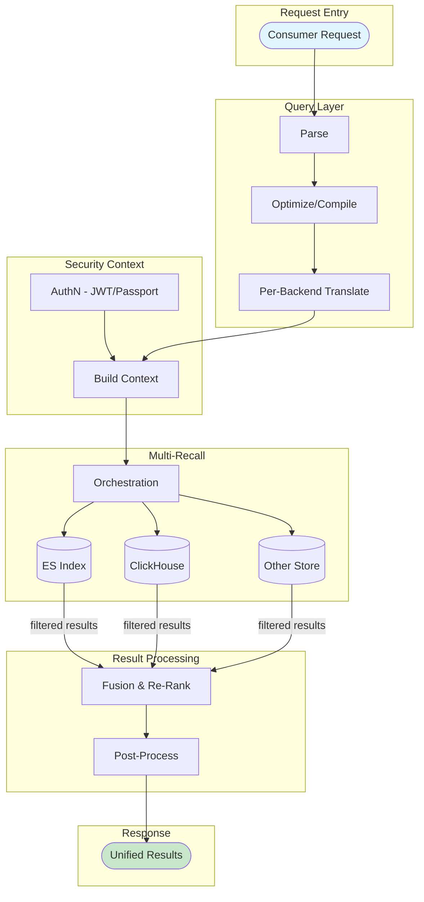

# Diagram Architecture

Generate architecture and integration diagrams using Mermaid syntax for wiki pages and documentation.

## When to Use

- Creating architecture diagrams for wiki component pages
- Visualizing integration flows between systems
- Documenting data pipelines and service interactions
- Converting ASCII art diagrams to Mermaid format
- Converting an existing diagram **image** (PNG/JPG) or **SVG** into Mermaid

## Diagram Types

| Type | Mermaid Syntax | Best For |
| --- | --- | --- |
| Flowchart | `flowchart TD` | Integration flows, data pipelines, request paths |
| Sequence | `sequenceDiagram` | API interactions, multi-service calls, auth flows |
| C4 Context | `C4Context` | High-level system boundaries |
| Block | `block-beta` | Layered architectures, stacks |

## Diagram Conversion & Alignment

When converting ASCII art diagrams to Mermaid, the tool automatically detects and preserves alignment:

### Alignment Detection

- **Vertical alignment (TD)**: Diagrams with `↓` arrows are converted to `flowchart TD`
- **Horizontal alignment (LR)**: Diagrams with `→` arrows are converted to `flowchart LR`

### Skipped Diagrams

The converter skips blocks containing box-drawing characters (`┌`, `┐`, `┘`, `┬`, `┴`, `┼`, `┤`, `├`) as these are typically UI mockups or ASCII art that don't convert well to Mermaid.

### Automatic Conversion

Use the `convert_ascii_to_mermaid.py` script:

```bash
# Convert single file (preserves alignment automatically)
python3 scripts/convert_ascii_to_mermaid.py /path/to/file.md

# Preview changes with --dry-run
python3 scripts/convert_ascii_to_mermaid.py --dry-run /path/to/file.md
```

## Image / SVG Input

The skill can transcribe an existing diagram (a rendered image or an SVG) into Mermaid. Pick the path by file type — **SVG is text and should be parsed, not eyeballed.**

### SVG → Mermaid (preferred when available)

An SVG is XML, so every node, label, and connector is recoverable exactly — no guessing. Do **not** use vision on an SVG; `Read` the file as text and reconstruct the graph from its elements:

| SVG element | Maps to |
| --- | --- |
| `<rect>` / `<path>` (rounded box, cylinder) | A **node** (position from `x`/`y`; shape hints type — cylinder `<path>` → `[(store)]`) |
| `<text>` | A node **label** or an **edge label** (match to the nearest node box, or to a small label chip near a connector) |
| `<line>` / `<polyline>` | An **edge**; follow `points` from the start box to the box nearest the `marker-end` (arrowhead) for direction |
| `stroke-dasharray` on a connector | A **dashed edge** (`-.->`) — dependency / manages / telemetry |
| Solid connector | A **solid edge** (`-->`) — deploy / data flow |
| Grouping container `<rect>` with a title `<text>` | A **subgraph** (nodes whose coordinates fall inside it belong to it) |

Method:
1. `Read` the SVG. List every box (label + approx x/y + shape) and every connector (start point → arrowhead point, solid vs dashed, nearby label chip).
2. Resolve each connector's endpoints to the nearest boxes by coordinate to get `A --> B`.
3. Group boxes into subgraphs by which container rectangle contains them.
4. Emit Mermaid, preserving edge labels, dashed/solid distinction, and grouping. Match shapes: databases/cylinders → `[(...)]`, queues → `{{...}}`, start/end → `([...])`.
5. Preserve the diagram title and any legend as a caption line under the diagram.

### Image (PNG/JPG) → Mermaid

Rendered rasters have no recoverable structure, so use vision:
1. `Read` the image file (Claude is multimodal — the image renders visually).
2. Transcribe every visible box label, then trace each arrow (note direction, solid vs dashed, and any text on the arrow).
3. Reconstruct groupings from visual containers/background panels.
4. Emit Mermaid following the shape and edge-label conventions below.
5. Because raster transcription can miss faint text or arrows, briefly list the components/edges you captured so the user can confirm nothing was dropped.

### Tips for faithful transcription

- Keep long subgraph titles on one line by padding with `&nbsp;` so the box renders wider than its widest inner node.
- Escape `<`, `>`, `/`, `(`, `)` in labels by wrapping the label in double quotes: `N["application.&lt;Dag&gt;.yaml"]`.
- Edges may point at a subgraph ID (not just a node) when the source arrow targets a group as a whole.

## Instructions

1. **Identify the diagram type** based on what's being visualized:
   - **Top-down flows** (request → processing → response) → `flowchart TD`
   - **Time-ordered interactions** (service A calls B, B responds) → `sequenceDiagram`
   - **Layered stacks** (layers building on each other) → `flowchart TD` with subgraphs

2. **Use subgraphs** to group related components:
   ```mermaid
   flowchart TD
       subgraph Layer["Layer Name"]
           A[Component A]
           B[Component B]
       end
   ```

3. **Style conventions**:
   - Use `[Component]` for processes/services
   - Use `[(Database)]` for data stores
   - Use `{{Decision}}` for decision points
   - Use `([Start/End])` for entry/exit points

4. **Label edges** with the action or data flowing:
   ```mermaid
   A -->|"request"| B
   B -->|"response"| A
   ```

5. **Output format**: Always wrap in triple backticks with `mermaid` language tag.

## Example: Integration Flow

Convert this style of architecture description into Mermaid:

**Input context**: "Consumer sends request → Query Layer parses → Security Context built → Multi-Recall fans out to ES/ClickHouse/other stores → Fusion & Re-rank → Post-process → Return results"

**Output**:



## Workflow

1. Read the source content — a wiki page, notes, a user description, or an existing diagram **image / SVG** (see [Image / SVG Input](#image--svg-input) for the transcription method)
2. Identify key components, their relationships, and data flows
3. Choose appropriate diagram type
4. Generate Mermaid code with proper structure
5. Insert into the wiki page under an `## Integration` or `## Architecture` section

## References

See `references/mermaid-patterns.md` for common diagram patterns.
