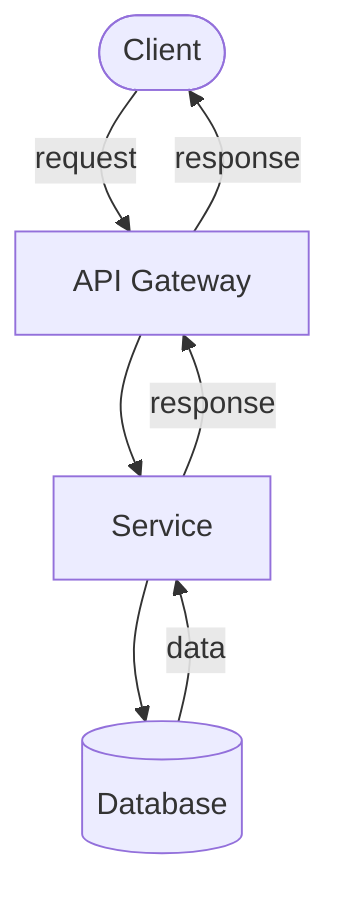
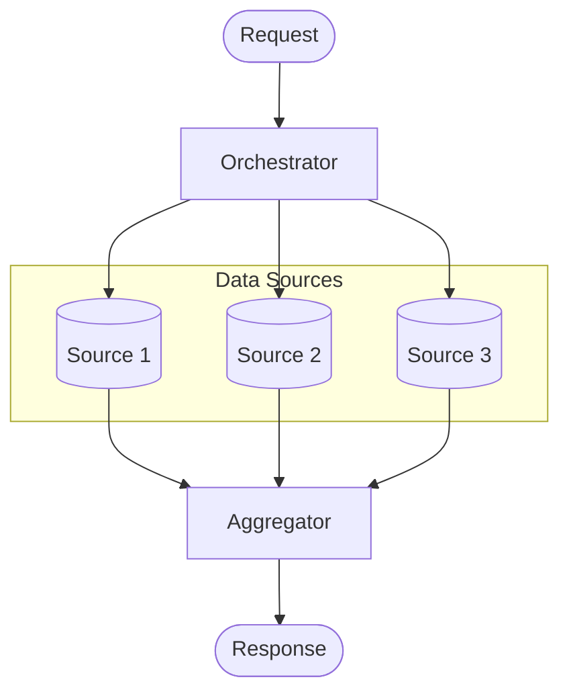
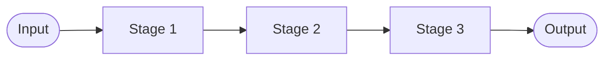
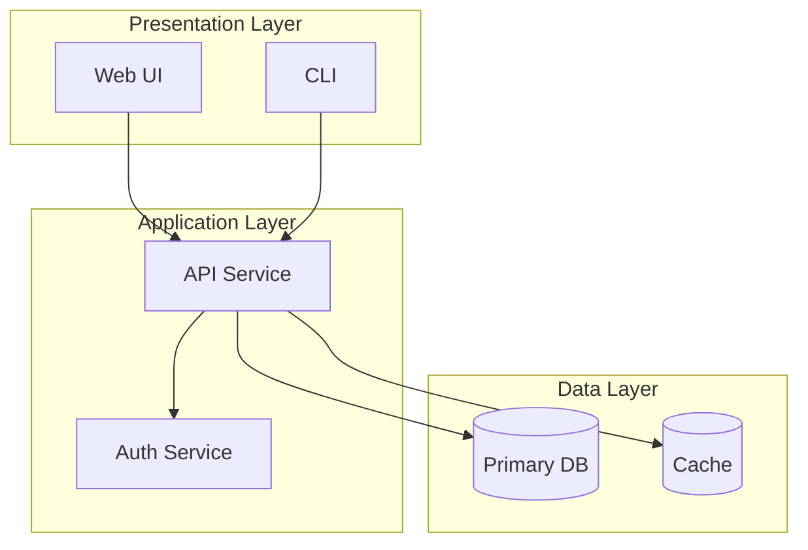
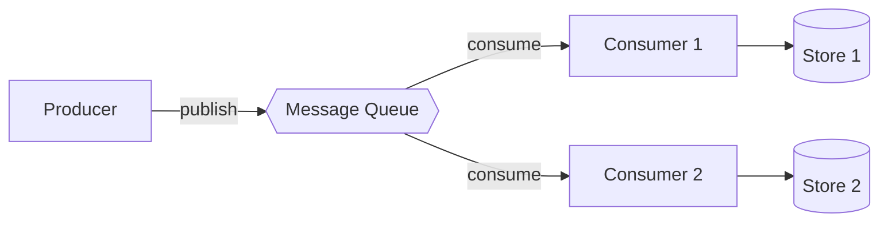
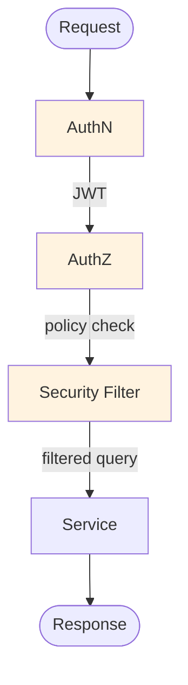
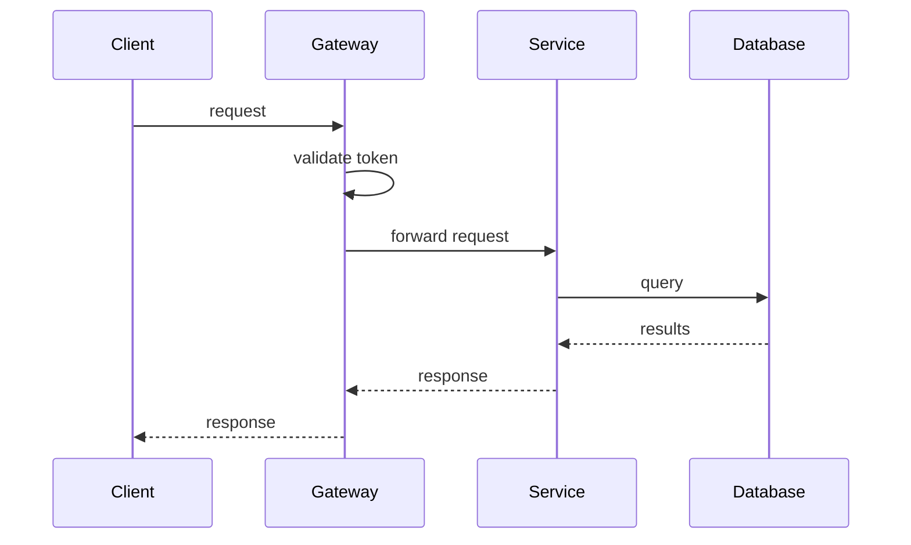
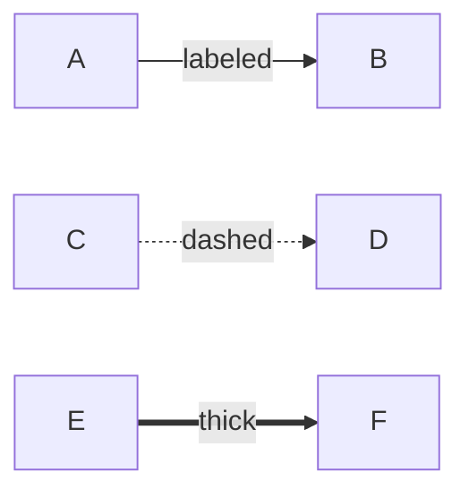
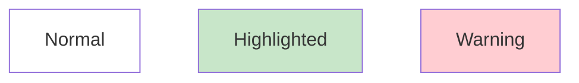

# Mermaid Architecture Patterns

Common patterns for architecture and integration diagrams.

## 1. Request-Response Flow

## 2. Fan-Out Pattern (Multi-Source Query)

## 3. Pipeline Pattern

## 4. Layered Architecture

## 5. Event-Driven Architecture

## 6. Security-Filtered Flow

## 7. Sequence Diagram (Service Interaction)

## Shape Reference

| Shape | Syntax | Use For |
| --- | --- | --- |
| Rectangle | `[Name]` | Services, components |
| Rounded | `(Name)` | Processes |
| Stadium | `([Name])` | Start/end points |
| Cylinder | `[(Name)]` | Databases, stores |
| Diamond | `{Name}` | Decisions |
| Hexagon | `{{Name}}` | Queues, async |
| Parallelogram | `[/Name/]` | Input/output |

## Edge Labels

## Styling

